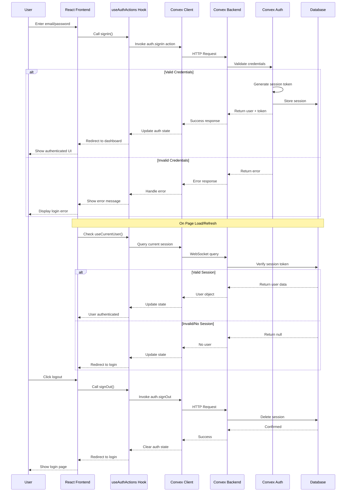

# Authentication Flow Diagram

## End-to-End Login and Authentication Process

## Key Components

### Frontend
- **AuthLayout**: Wraps auth pages, handles redirects
- **useAuthActions**: Hook providing signIn/signUp/signOut functions
- **useCurrentUser**: Hook for checking current auth state

### Backend
- **Convex Auth**: Built-in authentication system
- **Password Provider**: Handles email/password authentication
- **Session Management**: Automatic session token handling

### Data Flow
1. **Login**: UI → useAuthActions → Convex Action → Auth Provider → Database
2. **Session Check**: UI → useCurrentUser → Convex Query → Database
3. **Logout**: UI → useAuthActions → Convex Action → Database

### Security Features
- Password hashing (handled by Convex Auth)
- Session tokens stored securely
- Automatic session expiration
- HTTPS-only in production