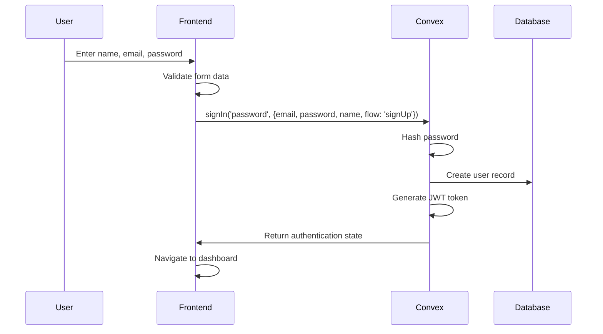
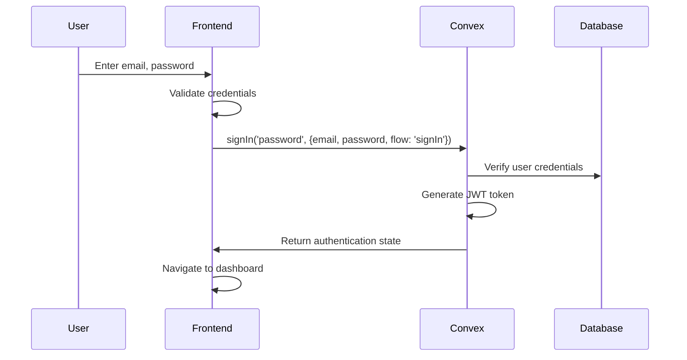
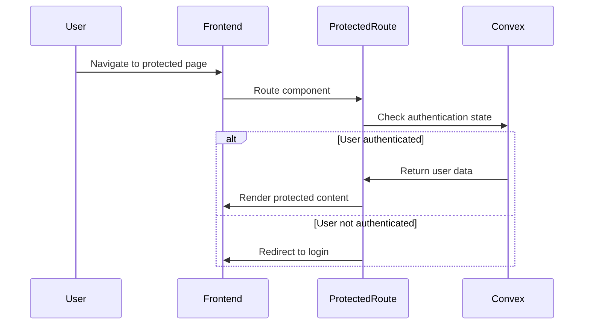

# Authentication Architecture - VRP System v4

## Overview

VRP System v4 implements a production-ready authentication system using Convex Auth with JWT-based session management, following the chef template pattern for secure user authentication without anonymous or demo features.

## Authentication Stack

### Backend (Convex)
- **Framework**: Convex Auth (@convex-dev/auth)
- **Provider**: Password Provider (email + password)
- **Session Management**: JWT-based with private key signing
- **Database**: Convex built-in user management with authTables

### Frontend (React)
- **Hooks**: @convex-dev/auth/react
- **Routing**: React Router with protected routes
- **State Management**: Real-time authentication state via Convex
- **Error Handling**: Centralized error handling utility

## Architecture Components

### 1. Backend Authentication (Convex)

#### Core Configuration
```typescript
// convex/auth.ts
export const { auth, signIn, signOut, store, isAuthenticated } = convexAuth({
  providers: [Password],
})
```

#### JWT Configuration
```typescript
// convex/auth.config.ts
export default {
  providers: [
    {
      domain: process.env.CONVEX_SITE_URL,
      applicationID: "convex",
    },
  ],
}
```

#### Environment Variables
- `JWT_PRIVATE_KEY`: RSA private key for JWT signing
- `JWKS`: JSON Web Key Set for JWT verification
- `CONVEX_SITE_URL`: Built-in Convex site URL

### 2. Frontend Authentication (React)

#### Authentication Hook
```typescript
// Usage in components
const { signIn } = useAuthActions()
const user = useAuthInfo()
```

#### Authentication Flow Parameters
- **Registration**: `flow: 'signUp'` with name, email, password
- **Login**: `flow: 'signIn'` with email, password
- **Other flows**: 'reset', 'reset-verification', 'email-verification'

#### Protected Routes
```typescript
// App.tsx routing structure
<Route path="/" element={<ProtectedRoute><HomePage /></ProtectedRoute>} />
<Route path="/auth/login" element={<LoginPage />} />
```

### 3. User Schema Integration

#### Database Schema
```typescript
// Inherits from Convex Auth
...authTables

// VRP entities reference user ownership
projects: defineTable({
  ownerId: v.id('users'), // References auth user
  // ... other fields
})
```

#### User Ownership Validation
```typescript
// Helper function for project ownership
export async function validateUserOwnership(ctx, projectId, userId) {
  const project = await ctx.db.get(projectId)
  if (project.ownerId !== userId) {
    throw new Error('Access denied')
  }
}
```

## Authentication Flow

### 1. User Registration


### 2. User Login


### 3. Protected Route Access


## Security Features

### 1. JWT Token Management
- **Private Key Signing**: RSA-2048 private key for JWT signing
- **Public Key Verification**: JWKS format for token verification
- **Token Expiration**: Automatic token expiration and renewal
- **Secure Storage**: Server-side session management

### 2. Password Security
- **Hashing**: Convex Auth handles secure password hashing
- **Validation**: Frontend and backend validation
- **Minimum Requirements**: 6+ character passwords

### 3. Route Protection
- **Real-time State**: WebSocket-based authentication state
- **Automatic Redirection**: Unauthenticated users redirected to login
- **Access Control**: User ownership validation for resources

### 4. Error Handling
- **Centralized Handling**: Consistent error messages across application
- **User Feedback**: Toast notifications and form validation
- **Security**: No sensitive information exposed in error messages

## Data Flow

### 1. Authentication State Management
```
User Action → Frontend Validation → Convex Auth → Database → Real-time State Update → UI Update
```

### 2. Protected Resource Access
```
Route Request → ProtectedRoute → Auth Check → User Validation → Resource Ownership → Content Render
```

### 3. Project Ownership Flow
```
Project Request → User Authentication → Project ID → Ownership Validation → Resource Access
```

## File Structure

### Backend Files
```
convex/
├── auth.ts                 # Main authentication configuration
├── auth.config.ts          # JWT provider configuration
├── schema.ts              # User schema integration
├── projects.ts            # Project ownership functions
└── _generated/            # Auto-generated Convex types
```

### Frontend Files
```
frontend/src/
├── components/
│   └── auth/
│       └── ProtectedRoute.tsx     # Route protection component
├── pages/
│   └── auth/
│       └── LoginPage.tsx          # Dual login/register page
├── hooks/
│   └── useVRPData.ts             # VRP data hooks with auth
├── utils/
│   └── errorHandling.ts          # Centralized error handling
└── App.tsx                       # Main routing with auth integration
```

## Configuration

### Environment Variables (Convex Dashboard)
- `JWT_PRIVATE_KEY`: RSA private key for JWT signing
- `JWKS`: JSON Web Key Set for public key verification

### Frontend Environment
- `VITE_CONVEX_URL`: Convex deployment URL
- No additional auth configuration needed (handled by Convex)

## Integration with VRP System

### 1. Project Ownership
- All projects have `ownerId` field referencing authenticated user
- Users can only access their own projects and related data
- Ownership validation enforced at API level

### 2. Data Hierarchy
```
User → Projects → Scenarios → Datasets → Tables (vehicles, jobs, locations, routes)
```

### 3. Real-time Updates
- Authentication state changes propagate immediately
- Project data updates reflect user permissions
- WebSocket connections maintain user context

## Security Considerations

### 1. No Anonymous Access
- All features require user authentication
- No demo or guest access modes
- Clean separation between authenticated and public routes

### 2. Data Isolation
- Users can only access their own data
- Server-side ownership validation
- No cross-user data leakage

### 3. Session Management
- JWT tokens with secure signing
- Automatic token refresh
- Secure logout with session cleanup

## Performance Features

### 1. Real-time Authentication
- WebSocket-based state management
- Instant authentication state updates
- No polling for authentication status

### 2. Optimized Queries
- Authenticated queries use user context
- Database indexes on ownership fields
- Efficient user-scoped data retrieval

### 3. Caching
- Convex handles query result caching
- Authentication state cached locally
- Optimized re-renders on auth changes

## Deployment Configuration

### Development
- Backend: https://modest-bat-713.convex.cloud
- Frontend: https://vrp-system-v4.pages.dev
- JWT keys configured in Convex dashboard

### Production Ready
- Environment variable separation
- Secure key management
- HTTPS enforcement
- Production-grade JWT configuration

This authentication architecture provides a secure, scalable foundation for the VRP System v4 while maintaining simplicity and following industry best practices.