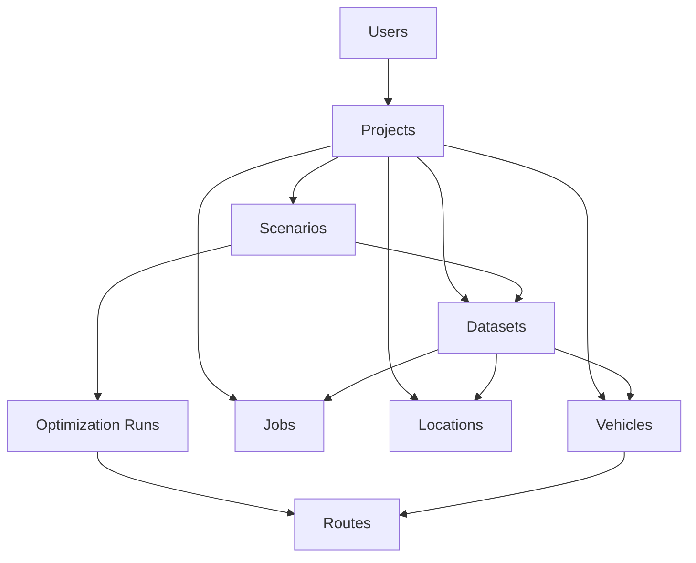
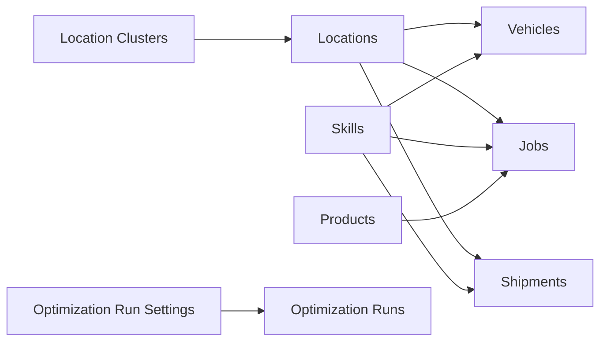

# VRP System v4 - Database Schema

## Document Information
- **Version**: 1.0
- **Last Updated**: 2025-07-06
- **Status**: Production Ready
- **Database Type**: Convex Document Database
- **Schema Lines**: 502 lines with comprehensive VRP data model
- **Total Indexes**: 58 optimized indexes

## 1. Schema Overview

The VRP System v4 database implements a comprehensive Vehicle Routing Problem data model using Convex's document database with real-time synchronization. The schema follows a strict four-level hierarchy: **Projects → Scenarios → Datasets → Tables** (vehicles, jobs, locations, routes).

### 1.1 Design Principles

- **Hierarchical Organization**: Four-level data hierarchy with denormalized projectId fields
- **User Ownership**: All data scoped to project owners with strict access control
- **Optimization Engine Compatibility**: Designed for VROOM, OR-Tools, and custom algorithms
- **Real-time Sync**: Automatic WebSocket updates for all data changes
- **Audit Trail**: Comprehensive timestamp tracking with creation and update times

### 1.2 Field Type Convention

```typescript
// ✅ REQUIRED FIELDS (Not Nullable) - Core business requirements
name: v.string(),                    // Always required for identification
projectId: v.id("projects"),         // Required for hierarchical ownership
createdAt: v.number(),               // Required for audit trail
updatedAt: v.number(),               // Required for change tracking

// ❓ OPTIONAL FIELDS (Nullable) - Business flexibility
description: v.optional(v.string()),  // Optional descriptive information
tags: v.optional(v.array(v.string())), // Optional categorization
```

## 2. Core Entity Tables

### 2.1 Projects Table

**Purpose**: Top-level container for VRP projects with user ownership

```typescript
projects: defineTable({
  // REQUIRED FIELDS (Not Nullable)
  name: v.string(),                    // ✅ Project name - always required
  ownerId: v.string(),                 // ✅ User ID from Convex Auth - required for ownership
  createdAt: v.number(),               // ✅ Creation timestamp - required for audit
  updatedAt: v.number(),               // ✅ Last update timestamp - required for audit
  
  // OPTIONAL FIELDS (Nullable) - Business metadata
  description: v.optional(v.string()),           // ❓ Project description
  currency: v.optional(v.string()),              // ❓ Currency code (USD, EUR, etc.)
  projectType: v.optional(v.string()),           // ❓ Project classification
  industry: v.optional(v.string()),              // ❓ Industry sector
  geographicRegion: v.optional(v.string()),      // ❓ Operating region
  priority: v.optional(v.string()),              // ❓ Project priority level
  estimatedVehicles: v.optional(v.number()),     // ❓ Expected vehicle count
  estimatedJobs: v.optional(v.number()),         // ❓ Expected job count
  planningHorizonDays: v.optional(v.number()),   // ❓ Planning period length
  contactPerson: v.optional(v.string()),         // ❓ Primary contact name
  contactEmail: v.optional(v.string()),          // ❓ Contact email
  contactPhone: v.optional(v.string()),          // ❓ Contact phone
  tags: v.optional(v.array(v.string())),         // ❓ Project tags for filtering
  notes: v.optional(v.string()),                 // ❓ Additional notes
})
```

**Indexes:**
```sql
.index("by_owner", ["ownerId"])        -- User data isolation
.index("by_updated_at", ["updatedAt"]) -- Chronological queries
```

**Constraints:**
- `name`: 1-100 characters
- `currency`: 3-character code (USD, EUR, etc.)
- `priority`: low, medium, high, critical
- `planningHorizonDays`: 1-365 days
- `tags`: Max 10 tags, 50 characters each

### 2.2 Scenarios Table

**Purpose**: Optimization scenarios within projects for testing different routing approaches

```typescript
scenarios: defineTable({
  // REQUIRED FIELDS (Not Nullable)
  projectId: v.id("projects"),         // ✅ Parent project reference - required relationship
  name: v.string(),                    // ✅ Scenario name - always required
  createdAt: v.number(),               // ✅ Creation timestamp - required for audit
  updatedAt: v.number(),               // ✅ Last update timestamp - required for audit
  
  // OPTIONAL FIELDS (Nullable) - Scenario configuration
  description: v.optional(v.string()),              // ❓ Scenario description
  startDate: v.optional(v.number()),                // ❓ Scenario start date
  endDate: v.optional(v.number()),                  // ❓ Scenario end date
  planningHorizonDays: v.optional(v.number()),      // ❓ Planning period override
  optimizationObjective: v.optional(v.string()),    // ❓ Primary optimization goal
  optimizationParameters: v.optional(v.object({})), // ❓ Custom optimization settings
  status: v.optional(v.string()),                   // ❓ Current scenario status
  tags: v.optional(v.array(v.string())),            // ❓ Scenario tags
  isActive: v.optional(v.boolean()),                // ❓ Active scenario flag
  lastOptimizedAt: v.optional(v.number()),          // ❓ Last optimization timestamp
  optimizationCount: v.optional(v.number()),        // ❓ Number of optimizations run
})
```

**Indexes:**
```sql
.index("by_project", ["projectId"])   -- Hierarchical relationship
.index("by_status", ["status"])       -- Status filtering
```

**Constraints:**
- `optimizationObjective`: minimize_cost, minimize_distance, minimize_duration, maximize_service_level
- `status`: draft, active, completed, archived
- `endDate` must be after `startDate` when both specified
- Only one scenario per project can be active at a time

### 2.3 Datasets Table

**Purpose**: Versioned data collections for optimization with cloning and baseline support

```typescript
datasets: defineTable({
  // REQUIRED FIELDS (Not Nullable)
  projectId: v.id("projects"),         // ✅ Parent project reference - required relationship
  name: v.string(),                    // ✅ Dataset name - always required
  version: v.number(),                 // ✅ Dataset version number - required for versioning
  createdAt: v.number(),               // ✅ Creation timestamp - required for audit
  updatedAt: v.number(),               // ✅ Last update timestamp - required for audit
  
  // OPTIONAL FIELDS (Nullable) - Dataset metadata
  scenarioId: v.optional(v.id("scenarios")),        // ❓ Optional scenario assignment
  description: v.optional(v.string()),              // ❓ Dataset description
  status: v.optional(v.string()),                   // ❓ Dataset status (active, archived, etc.)
  createdFromDatasetId: v.optional(v.id("datasets")), // ❓ Source dataset for cloning
  isBaseline: v.optional(v.boolean()),              // ❓ Baseline dataset flag
  tags: v.optional(v.array(v.string())),            // ❓ Dataset tags
  vehicleCount: v.optional(v.number()),             // ❓ Cached vehicle count
  jobCount: v.optional(v.number()),                 // ❓ Cached job count
  locationCount: v.optional(v.number()),            // ❓ Cached location count
  optimizationRunCount: v.optional(v.number()),     // ❓ Number of optimization runs
  optimizationCount: v.optional(v.number()),        // ❓ Total optimization count
  lastOptimizationAt: v.optional(v.number()),       // ❓ Last optimization timestamp
  datasetType: v.optional(v.string()),              // ❓ Dataset type classification
  versionNote: v.optional(v.string()),              // ❓ Version change notes
  entityCounts: v.optional(v.object({               // ❓ Detailed entity counts
    jobs: v.number(),                               // Required if entityCounts exists
    vehicles: v.number(),                           // Required if entityCounts exists
    locations: v.number(),                          // Required if entityCounts exists
  })),
  createdBy: v.optional(v.string()),                // ❓ User who created the dataset
  archivedAt: v.optional(v.number()),               // ❓ Archive timestamp
})
```

**Indexes:**
```sql
.index("by_project", ["projectId"])         -- Hierarchical relationship
.index("by_scenario", ["scenarioId"])       -- Scenario assignment
.index("by_status", ["status"])             -- Status filtering
.index("by_version", ["projectId", "version"]) -- Version management
```

**Constraints:**
- `datasetType`: baseline, variant, test, production
- `status`: draft, active, archived
- `version`: Auto-incremented within project scope
- `versionNote`: Max 500 characters

## 3. VRP Entity Tables

### 3.1 Vehicles Table

**Purpose**: Fleet vehicle definitions with capacity, constraints, and optimization engine compatibility

```typescript
vehicles: defineTable({
  // REQUIRED FIELDS (Not Nullable)
  projectId: v.id("projects"),         // ✅ Parent project reference - required relationship
  // NOTE: Use _creationTime instead of createdAt (auto-managed by Convex)
  updatedAt: v.number(),               // ✅ Last update timestamp - required for audit
  optimizerId: v.number(),             // ✅ Numeric ID for optimization engines - required for API compatibility
  
  // OPTIONAL FIELDS (Nullable) - Vehicle configuration
  scenarioId: v.optional(v.id("scenarios")),        // ❓ Optional scenario assignment
  datasetId: v.optional(v.id("datasets")),          // ❓ Optional dataset assignment
  description: v.optional(v.string()),              // ❓ Vehicle description/name
  profile: v.optional(v.string()),                  // ❓ Vehicle profile (car, truck, bike)
  
  // Location coordinates (either coordinates or location references)
  startLon: v.optional(v.number()),                 // ❓ Starting longitude
  startLat: v.optional(v.number()),                 // ❓ Starting latitude
  endLon: v.optional(v.number()),                   // ❓ Ending longitude
  endLat: v.optional(v.number()),                   // ❓ Ending latitude
  startLocationId: v.optional(v.id("locations")),   // ❓ Starting location reference
  endLocationId: v.optional(v.id("locations")),     // ❓ Ending location reference
  
  // Vehicle capabilities
  capacity: v.optional(v.array(v.number())),        // ❓ Multi-dimensional capacity array
  skills: v.optional(v.array(v.number())),          // ❓ Vehicle skill IDs
  
  // Time windows and constraints
  twStart: v.optional(v.number()),                  // ❓ Time window start
  twEnd: v.optional(v.number()),                    // ❓ Time window end
  speedFactor: v.optional(v.number()),              // ❓ Speed modification factor
  maxTasks: v.optional(v.number()),                 // ❓ Maximum tasks per route
  maxTravelTime: v.optional(v.number()),            // ❓ Maximum travel time
  maxDistance: v.optional(v.number()),              // ❓ Maximum distance
  
  // Cost structure
  costFixed: v.optional(v.number()),                // ❓ Fixed cost per vehicle
  costPerHour: v.optional(v.number()),              // ❓ Hourly operating cost
  costPerKm: v.optional(v.number()),                // ❓ Distance-based cost
  
  // Dataset metadata
  datasetName: v.optional(v.string()),              // ❓ Source dataset name
  datasetVersion: v.optional(v.number()),           // ❓ Source dataset version
})
```

**Indexes:**
```sql
.index("by_project", ["projectId"])         -- Hierarchical relationship
.index("by_scenario", ["scenarioId"])       -- Scenario assignment
.index("by_dataset", ["datasetId"])         -- Dataset assignment
.index("by_location", ["startLocationId"])  -- Location relationships
.index("by_optimizer_id", ["optimizerId"])  -- Required for VROOM ID mapping
```

**Constraints:**
- `profile`: car, truck, van, bike, walking, motorcycle
- `capacity`: Max 10 dimensions, non-negative values
- `skills`: Max 50 skills, non-negative IDs
- `speedFactor`: 0.1 to 10.0
- `maxTasks`: 1 to 1000
- `optimizerId`: Unique within project scope

### 3.2 Jobs Table

**Purpose**: Individual tasks/stops for vehicles with time windows and capacity requirements

```typescript
jobs: defineTable({
  // REQUIRED FIELDS (Not Nullable)
  projectId: v.id("projects"),         // ✅ Parent project reference - required relationship
  // NOTE: Use _creationTime instead of createdAt (auto-managed by Convex)
  updatedAt: v.number(),               // ✅ Last update timestamp - required for audit
  optimizerId: v.number(),             // ✅ Numeric ID for optimization engines - required for API compatibility
  
  // OPTIONAL FIELDS (Nullable) - Job configuration
  scenarioId: v.optional(v.id("scenarios")),        // ❓ Optional scenario assignment
  datasetId: v.optional(v.id("datasets")),          // ❓ Optional dataset assignment
  locationId: v.optional(v.id("locations")),        // ❓ Location reference
  description: v.optional(v.string()),              // ❓ Job description
  
  // Location coordinates (alternative to locationId)
  locationLon: v.optional(v.number()),              // ❓ Job longitude
  locationLat: v.optional(v.number()),              // ❓ Job latitude
  
  // Time requirements
  setup: v.optional(v.number()),                    // ❓ Setup time (seconds)
  service: v.optional(v.number()),                  // ❓ Service time (seconds)
  
  // Capacity requirements
  delivery: v.optional(v.array(v.number())),        // ❓ Delivery quantities
  pickup: v.optional(v.array(v.number())),          // ❓ Pickup quantities
  
  // Job constraints
  skills: v.optional(v.array(v.number())),          // ❓ Required skill IDs
  priority: v.optional(v.number()),                 // ❓ Job priority level
  timeWindows: v.optional(v.array(v.object({        // ❓ Valid service time windows
    start: v.number(),                              // Required if timeWindows exists
    end: v.number(),                                // Required if timeWindows exists
  }))),
  
  // Dataset metadata
  datasetName: v.optional(v.string()),              // ❓ Source dataset name
  datasetVersion: v.optional(v.number()),           // ❓ Source dataset version
})
```

**Indexes:**
```sql
.index("by_project", ["projectId"])         -- Hierarchical relationship
.index("by_scenario", ["scenarioId"])       -- Scenario assignment
.index("by_dataset", ["datasetId"])         -- Dataset assignment
.index("by_location", ["locationId"])       -- Location relationships
.index("by_priority", ["priority"])         -- Priority-based queries (0-100 range)
.index("by_optimizer_id", ["optimizerId"])  -- Optimization engine ID mapping
```

**Constraints:**
- `delivery`/`pickup`: Max 10 dimensions, non-negative values
- `skills`: Max 50 skills, non-negative IDs
- `priority`: 0-100 range for optimization engines
- `timeWindows`: Max 5 windows, end > start
- `optimizerId`: Auto-incremented within project

### 3.3 Locations Table

**Purpose**: Geographic points of interest with coordinates and metadata

```typescript
locations: defineTable({
  // REQUIRED FIELDS (Not Nullable)
  projectId: v.id("projects"),         // ✅ Parent project reference - required relationship
  name: v.string(),                    // ✅ Location name - always required
  // NOTE: Use _creationTime instead of createdAt (auto-managed by Convex)
  updatedAt: v.number(),               // ✅ Last update timestamp - required for audit
  
  // OPTIONAL FIELDS (Nullable) - Location details
  scenarioId: v.optional(v.id("scenarios")),        // ❓ Optional scenario assignment
  datasetId: v.optional(v.id("datasets")),          // ❓ Optional dataset assignment
  clusterId: v.optional(v.id("locationClusters")),  // ❓ Location cluster assignment
  address: v.optional(v.string()),                  // ❓ Physical address
  description: v.optional(v.string()),              // ❓ Location description
  locationLon: v.optional(v.number()),              // ❓ Longitude coordinate
  locationLat: v.optional(v.number()),              // ❓ Latitude coordinate
  locationType: v.optional(v.string()),             // ❓ Type (depot, customer, warehouse)
  operatingHours: v.optional(v.string()),           // ❓ Operating hours string
  contactInfo: v.optional(v.string()),              // ❓ Contact information
  timezone: v.optional(v.string()),                 // ❓ Location timezone
  datasetName: v.optional(v.string()),              // ❓ Source dataset name
  datasetVersion: v.optional(v.number()),           // ❓ Source dataset version
})
```

**Indexes:**
```sql
.index("by_project", ["projectId"])     -- Hierarchical relationship
.index("by_scenario", ["scenarioId"])   -- Scenario assignment
.index("by_dataset", ["datasetId"])     -- Dataset assignment
.index("by_cluster", ["clusterId"])     -- Cluster relationships
.index("by_type", ["locationType"])     -- Type filtering
.index("by_name", ["name"])             -- Name-based search
```

**Constraints:**
- `name`: 1-100 characters (required)
- `address`: Max 300 characters
- `locationType`: depot, customer, warehouse, distribution_center, pickup_point, delivery_point
- `operatingHours`: Max 100 characters
- Coordinates: -180 to 180 (longitude), -90 to 90 (latitude)

### 3.4 Routes Table

**Purpose**: Optimization results and route summaries from solver engines

```typescript
routes: defineTable({
  // REQUIRED FIELDS (Not Nullable)
  // NOTE: Use _creationTime instead of createdAt (auto-managed by Convex)
  updatedAt: v.number(),               // ✅ Last update timestamp - required for audit
  
  // OPTIONAL FIELDS (Nullable) - Routes may be partial or in draft state
  optimizationRunId: v.optional(v.id("optimizationRuns")), // ❓ Parent optimization run
  vehicleId: v.optional(v.id("vehicles")),        // ❓ Assigned vehicle
  projectId: v.optional(v.id("projects")),        // ❓ Project reference
  
  // Route metrics
  cost: v.optional(v.number()),                   // ❓ Total route cost
  distance: v.optional(v.number()),               // ❓ Total distance traveled
  duration: v.optional(v.number()),               // ❓ Total route duration
  waitingTime: v.optional(v.number()),            // ❓ Total waiting time
  serviceTime: v.optional(v.number()),            // ❓ Total service time
  setupTime: v.optional(v.number()),              // ❓ Total setup time
  
  // Route content summary
  deliveries: v.optional(v.array(v.number())),    // ❓ Delivery quantities
  pickups: v.optional(v.array(v.number())),       // ❓ Pickup quantities
  priority: v.optional(v.number()),               // ❓ Route priority
  deliveryCount: v.optional(v.number()),          // ❓ Number of deliveries
  
  // Route violations and geometry
  violations: v.optional(v.array(v.object({}))),  // ❓ Constraint violations
  geometry: v.optional(v.string()),               // ❓ Route geometry (WKT/GeoJSON)
  geojson: v.optional(v.object({})),              // ❓ GeoJSON representation
  
  // Metadata
  currencyCode: v.optional(v.string()),           // ❓ Currency for cost values
  datasetName: v.optional(v.string()),            // ❓ Source dataset name
  datasetVersion: v.optional(v.number()),         // ❓ Source dataset version
})
```

**Indexes:**
```sql
.index("by_optimization_run", ["optimizationRunId"]) -- Optimization results
.index("by_vehicle", ["vehicleId"])                  -- Vehicle assignments
.index("by_project", ["projectId"])                  -- Project filtering
```

**Constraints:**
- All numeric values must be non-negative
- `geometry`: Max 10,000 characters
- `currencyCode`: 3-character code
- `priority`: 0-100 range

## 4. Advanced Entity Tables

### 4.1 Shipments Table

**Purpose**: Pickup and delivery pairs with VROOM compatibility

```typescript
shipments: defineTable({
  // REQUIRED FIELDS (Not Nullable)
  projectId: v.id("projects"),         // ✅ Parent project reference - required relationship
  optimizerId: v.number(),             // ✅ Numeric ID for optimization engines - required for API compatibility
  updatedAt: v.number(),               // ✅ Last update timestamp - required for audit
  
  // OPTIONAL FIELDS (Nullable) - Shipment configuration
  scenarioId: v.optional(v.id("scenarios")),        // ❓ Optional scenario assignment
  datasetId: v.optional(v.id("datasets")),          // ❓ Optional dataset assignment
  description: v.optional(v.string()),              // ❓ Shipment description
  
  // Pickup location coordinates
  pickupLon: v.optional(v.number()),                // ❓ Pickup longitude
  pickupLat: v.optional(v.number()),                // ❓ Pickup latitude
  pickupLocationId: v.optional(v.id("locations")),  // ❓ Pickup location reference
  
  // Delivery location coordinates
  deliveryLon: v.optional(v.number()),              // ❓ Delivery longitude
  deliveryLat: v.optional(v.number()),              // ❓ Delivery latitude
  deliveryLocationId: v.optional(v.id("locations")), // ❓ Delivery location reference
  
  // Capacity requirements (must be exactly 3 elements for VROOM)
  amount: v.optional(v.array(v.number())),          // ❓ Shipment quantities [weight, volume, count]
  
  // Job constraints
  skills: v.optional(v.array(v.number())),          // ❓ Required skill IDs
  priority: v.optional(v.number()),                 // ❓ Shipment priority (0-100 for VROOM)
  
  // Pickup timing
  pickupSetup: v.optional(v.number()),              // ❓ Pickup setup time (seconds)
  pickupService: v.optional(v.number()),            // ❓ Pickup service time (seconds)
  pickupTimeWindows: v.optional(v.array(v.object({ // ❓ Pickup time windows
    start: v.number(),                              // Required if pickupTimeWindows exists
    end: v.number(),                                // Required if pickupTimeWindows exists
  }))),
  
  // Delivery timing
  deliverySetup: v.optional(v.number()),            // ❓ Delivery setup time (seconds)
  deliveryService: v.optional(v.number()),          // ❓ Delivery service time (seconds)
  deliveryTimeWindows: v.optional(v.array(v.object({ // ❓ Delivery time windows
    start: v.number(),                              // Required if deliveryTimeWindows exists
    end: v.number(),                                // Required if deliveryTimeWindows exists
  }))),
  
  // Dataset metadata
  datasetName: v.optional(v.string()),              // ❓ Source dataset name
  datasetVersion: v.optional(v.number()),           // ❓ Source dataset version
})
```

**Indexes:**
```sql
.index("by_project", ["projectId"])              -- Hierarchical relationship
.index("by_scenario", ["scenarioId"])            -- Scenario assignment
.index("by_dataset", ["datasetId"])              -- Dataset assignment
.index("by_pickup_location", ["pickupLocationId"]) -- Pickup relationships
.index("by_delivery_location", ["deliveryLocationId"]) -- Delivery relationships
.index("by_priority", ["priority"])              -- Priority ordering
.index("by_optimizer_id", ["optimizerId"])       -- Optimization engine mapping
```

### 4.2 Products Table

**Purpose**: Items being transported with physical characteristics

```typescript
products: defineTable({
  // REQUIRED FIELDS (Not Nullable)
  projectId: v.id("projects"),         // ✅ Parent project reference - required relationship
  name: v.string(),                    // ✅ Product name - always required
  unitType: v.string(),                // ✅ Unit of measurement - required for calculations
  updatedAt: v.number(),               // ✅ Last update timestamp - required for audit
  
  // OPTIONAL FIELDS (Nullable) - Product characteristics
  category: v.optional(v.string()),                 // ❓ Product category
  weightPerUnitKg: v.optional(v.number()),          // ❓ Weight per unit in kilograms
  volumePerUnitM3: v.optional(v.number()),          // ❓ Volume per unit in cubic meters
  lengthCm: v.optional(v.number()),                 // ❓ Length in centimeters
  widthCm: v.optional(v.number()),                  // ❓ Width in centimeters
  heightCm: v.optional(v.number()),                 // ❓ Height in centimeters
  stackable: v.optional(v.boolean()),               // ❓ Can be stacked flag
  requiresRefrigeration: v.optional(v.boolean()),   // ❓ Refrigeration required flag
  hazmatClass: v.optional(v.string()),              // ❓ Hazardous material classification
  handlingInstructions: v.optional(v.string()),     // ❓ Special handling instructions
})
```

**Indexes:**
```sql
.index("by_project", ["projectId"])     -- Hierarchical relationship
.index("by_category", ["category"])     -- Category filtering
.index("by_name", ["name"])             -- Name-based search
```

### 4.3 Skills Table

**Purpose**: Capabilities required for jobs or possessed by vehicles

```typescript
skills: defineTable({
  // REQUIRED FIELDS (Not Nullable)
  updatedAt: v.number(),               // ✅ Last update timestamp - required for audit
  
  // OPTIONAL FIELDS (Nullable) - Note: Skills can be global or project-specific
  projectId: v.optional(v.id("projects")),          // ❓ Optional project scope (null = global skill)
  name: v.optional(v.string()),                     // ❓ Skill name
  description: v.optional(v.string()),              // ❓ Skill description
  skillCode: v.optional(v.string()),                // ❓ Unique skill code
  category: v.optional(v.string()),                 // ❓ Skill category
  subcategory: v.optional(v.string()),              // ❓ Skill subcategory
  parentSkillId: v.optional(v.id("skills")),        // ❓ Parent skill for hierarchy
  skillType: v.optional(v.string()),                // ❓ Type of skill
  requiresCertification: v.optional(v.boolean()),   // ❓ Certification required flag
  certificationAuthority: v.optional(v.string()),   // ❓ Certifying authority
  certificationExpiryRequired: v.optional(v.boolean()), // ❓ Expiry tracking required
  optimizerSkillId: v.optional(v.number()),         // ❓ Optimization engine skill ID
  isActive: v.optional(v.boolean()),                // ❓ Active skill flag
})
```

**Indexes:**
```sql
.index("by_project", ["projectId"])         -- Project scoping
.index("by_category", ["category"])         -- Category filtering
.index("by_skill_code", ["skillCode"])      -- Code lookups
.index("by_parent", ["parentSkillId"])      -- Hierarchical relationships
```

## 5. Optimization and Execution Tables

### 5.1 Optimization Run Settings Table

**Purpose**: Configuration templates for optimization algorithms

```typescript
optimizationRunSettings: defineTable({
  // REQUIRED FIELDS (Not Nullable)
  datasetId: v.id("datasets"),         // ✅ Target dataset - required relationship
  name: v.string(),                    // ✅ Settings name - always required
  algorithm: v.string(),               // ✅ Algorithm type - required for execution
  optimizationEngine: v.string(),      // ✅ Engine type (VROOM, OR-Tools) - required
  parameters: v.object({               // ✅ Algorithm parameters - required object
    maxIterations: v.optional(v.number()),         // ❓ Maximum iterations
    timeLimit: v.optional(v.number()),             // ❓ Time limit in seconds
    vehicleBreaks: v.optional(v.boolean()),        // ❓ Enable vehicle breaks
    trafficMatrix: v.optional(v.boolean()),        // ❓ Use traffic matrix
    balanceRoutes: v.optional(v.boolean()),        // ❓ Balance route loads
    minimizeVehicles: v.optional(v.boolean()),     // ❓ Minimize vehicle count
    allowSplitDeliveries: v.optional(v.boolean()), // ❓ Allow split deliveries
  }),
  updatedAt: v.number(),               // ✅ Last update timestamp - required for audit
  
  // OPTIONAL FIELDS (Nullable) - Advanced configuration
  description: v.optional(v.string()),              // ❓ Settings description
  constraints: v.optional(v.object({                // ❓ Optimization constraints
    maxVehicleCapacity: v.optional(v.number()),     // ❓ Maximum vehicle capacity
    maxRouteDistance: v.optional(v.number()),       // ❓ Maximum route distance
    maxRouteDuration: v.optional(v.number()),       // ❓ Maximum route duration
    enforceTimeWindows: v.optional(v.boolean()),    // ❓ Enforce time windows
    enforceSkillMatching: v.optional(v.boolean()),  // ❓ Enforce skill matching
  })),
  objectives: v.optional(v.object({                 // ❓ Optimization objectives
    minimizeCost: v.optional(v.number()),           // ❓ Cost minimization weight
    minimizeDistance: v.optional(v.number()),       // ❓ Distance minimization weight
    minimizeDuration: v.optional(v.number()),       // ❓ Duration minimization weight
    maximizeServiceLevel: v.optional(v.number()),   // ❓ Service level weight
  })),
  isDefault: v.optional(v.boolean()),               // ❓ Default settings flag
  isActive: v.optional(v.boolean()),                // ❓ Active settings flag
  createdBy: v.optional(v.string()),                // ❓ User who created settings
})
```

**Indexes:**
```sql
.index("by_dataset", ["datasetId"])     -- Dataset association
.index("by_algorithm", ["algorithm"])   -- Algorithm filtering
.index("by_default", ["isDefault"])     -- Default settings
.index("by_active", ["isActive"])       -- Active settings
```

### 5.2 Optimization Runs Table

**Purpose**: Results and metadata from optimization executions

```typescript
optimizationRuns: defineTable({
  // REQUIRED FIELDS (Not Nullable)
  scenarioId: v.id("scenarios"),       // ✅ Parent scenario - required relationship
  timestamp: v.number(),               // ✅ Run timestamp - required for tracking
  currencyCode: v.string(),            // ✅ Currency for cost calculations - required
  algorithm: v.string(),               // ✅ Algorithm used - required for reference
  durationMs: v.number(),              // ✅ Execution duration - required for performance tracking
  settings: v.object({}),              // ✅ Settings used - required for reproducibility
  optimizationEngine: v.string(),      // ✅ Engine used - required for tracking
  optimizationParameters: v.object({}), // ✅ Parameters used - required for reproducibility
  
  // OPTIONAL FIELDS (Nullable) - Execution results
  projectId: v.optional(v.id("projects")),          // ❓ Optional project reference (derived from scenario)
  datasetId: v.optional(v.id("datasets")),          // ❓ Optional dataset reference
  optimizationRunSettingsId: v.optional(v.id("optimizationRunSettings")), // ❓ Settings template used
  
  // Execution metadata
  computingTime: v.optional(v.number()),            // ❓ Server computing time
  status: v.optional(v.string()),                   // ❓ Run status (success, failed, running)
  errorMessage: v.optional(v.string()),             // ❓ Error details if failed
  
  // Result summary statistics
  totalCost: v.optional(v.number()),                // ❓ Total optimization cost
  totalRoutes: v.optional(v.number()),              // ❓ Number of routes generated
  totalUnassigned: v.optional(v.number()),          // ❓ Number of unassigned tasks
  totalDistance: v.optional(v.number()),            // ❓ Total distance traveled
  totalDuration: v.optional(v.number()),            // ❓ Total route duration
  totalWaitingTime: v.optional(v.number()),         // ❓ Total waiting time
  totalServiceTime: v.optional(v.number()),         // ❓ Total service time
  totalSetupTime: v.optional(v.number()),           // ❓ Total setup time
  totalVehicles: v.optional(v.number()),            // ❓ Number of vehicles used
  totalJobs: v.optional(v.number()),                // ❓ Number of jobs processed
  totalShipments: v.optional(v.number()),           // ❓ Number of shipments processed
  
  // Raw data for debugging
  rawRequest: v.optional(v.object({})),             // ❓ Original solver request
  rawResponse: v.optional(v.object({})),            // ❓ Raw solver response
  
  // Dataset metadata
  datasetName: v.optional(v.string()),              // ❓ Source dataset name
  datasetVersion: v.optional(v.number()),           // ❓ Source dataset version
  createdBy: v.optional(v.string()),                // ❓ User who initiated the run
})
```

**Indexes:**
```sql
.index("by_scenario", ["scenarioId"])            -- Scenario association
.index("by_project", ["projectId"])             -- Project filtering
.index("by_dataset", ["datasetId"])             -- Dataset association
.index("by_settings", ["optimizationRunSettingsId"]) -- Settings tracking
.index("by_status", ["status"])                 -- Status filtering
.index("by_timestamp", ["timestamp"])           -- Chronological queries
```

## 6. Supporting and Utility Tables

### 6.1 Location Cluster Tables

**Purpose**: Geographic grouping of locations for visualization and organization

```typescript
locationClusters: defineTable({
  projectId: v.id("projects"),         // ✅ Required project association
  name: v.string(),                    // ✅ Cluster name
  description: v.optional(v.string()),              // ❓ Cluster description
  centerLon: v.optional(v.number()),                // ❓ Cluster center longitude
  centerLat: v.optional(v.number()),                // ❓ Cluster center latitude
  radius: v.optional(v.number()),                   // ❓ Cluster radius in meters
  color: v.optional(v.string()),                    // ❓ Display color
  updatedAt: v.number(),               // ✅ Last update timestamp
})

locationClusterMembership: defineTable({
  locationId: v.id("locations"),       // ✅ Location reference
  clusterId: v.id("locationClusters"), // ✅ Cluster reference
  updatedAt: v.number(),               // ✅ Last update timestamp
})
```

**Indexes:**
```sql
-- locationClusters
.index("by_project", ["projectId"])

-- locationClusterMembership  
.index("by_location", ["locationId"])
.index("by_cluster", ["clusterId"])
```

### 6.2 Project Users Table

**Purpose**: Multi-user project collaboration and permissions

```typescript
projectUsers: defineTable({
  projectId: v.id("projects"),         // ✅ Project reference
  userId: v.string(),                  // ✅ User ID
  role: v.string(),                    // ✅ User role
  permissions: v.optional(v.array(v.string())),     // ❓ Specific permissions
  invitedBy: v.optional(v.string()),                // ❓ Inviting user
  invitedAt: v.optional(v.number()),                // ❓ Invitation timestamp
  joinedAt: v.optional(v.number()),                 // ❓ Join timestamp
  status: v.optional(v.string()),                   // ❓ Membership status
})
```

**Indexes:**
```sql
.index("by_project", ["projectId"])     -- Project members
.index("by_user", ["userId"])           -- User memberships
.index("by_role", ["role"])             -- Role filtering
```

### 6.3 Legacy Tasks Table

**Purpose**: Legacy task system (maintained for compatibility)

```typescript
tasks: defineTable({
  text: v.string(),                    // ✅ Task description
  isCompleted: v.boolean(),            // ✅ Completion status
})
```

## 7. Database Relationships

### 7.1 Hierarchical Relationships



### 7.2 Cross-Cutting Relationships



### 7.3 Foreign Key Constraints

**Implicit Constraints (Enforced by Application Logic):**
- All child entities must reference valid parent entities
- Cross-project references are forbidden
- Users can only access entities they own
- Optimization runs must reference existing scenarios
- Routes must reference existing optimization runs

**Referential Integrity Checks:**
- Cannot delete locations referenced by vehicles
- Cannot delete locations referenced by jobs
- Cannot delete datasets with associated entities
- Cannot delete projects with child entities (requires cascading delete)

## 8. Index Strategy and Performance

### 8.1 Index Categories

**Primary Access Patterns (58 Total Indexes):**

1. **User Data Isolation (5 indexes)**
   ```sql
   projects.by_owner(ownerId)
   projectUsers.by_user(userId)
   skills.by_project(projectId)
   ```

2. **Hierarchical Navigation (15 indexes)**
   ```sql
   *.by_project(projectId)        -- All entities by project
   *.by_scenario(scenarioId)      -- Scenario assignments
   *.by_dataset(datasetId)        -- Dataset assignments
   ```

3. **Optimization Engine Support (8 indexes)**
   ```sql
   vehicles.by_optimizer_id(optimizerId)
   jobs.by_optimizer_id(optimizerId)
   shipments.by_optimizer_id(optimizerId)
   skills.by_skill_code(skillCode)
   ```

4. **Performance Optimization (12 indexes)**
   ```sql
   *.by_updated_at(updatedAt)     -- Chronological queries
   *.by_status(status)            -- Status filtering
   jobs.by_priority(priority)     -- Priority ordering
   optimizationRuns.by_timestamp(timestamp)
   ```

5. **Relationship Navigation (10 indexes)**
   ```sql
   vehicles.by_location(startLocationId)
   jobs.by_location(locationId)
   routes.by_vehicle(vehicleId)
   routes.by_optimization_run(optimizationRunId)
   ```

6. **Search and Filtering (8 indexes)**
   ```sql
   locations.by_name(name)
   locations.by_type(locationType)
   products.by_category(category)
   skills.by_category(category)
   ```

### 8.2 Query Performance Characteristics

**Typical Query Performance:**
- Single entity by ID: < 10ms
- User's projects list: < 20ms
- Project entities (vehicles/jobs/locations): < 50ms
- Complex filtered queries: < 100ms
- Bulk operations (1000+ entities): < 2 seconds

**Index Utilization:**
- All user data queries use `by_owner` or `by_project` indexes
- Hierarchical navigation uses compound indexes
- Search operations use dedicated text/category indexes
- Optimization engine queries use numeric ID indexes

## 9. Data Validation and Constraints

### 9.1 Business Rule Constraints

**Project Level:**
- Project names must be unique per user
- Currency codes must be valid 3-character codes
- Planning horizon must be 1-365 days

**Scenario Level:**
- Only one active scenario per project
- End dates must be after start dates
- Optimization objectives must be valid enum values

**Dataset Level:**
- Version numbers auto-increment within project
- Baseline datasets limited to one per project
- Entity counts must match actual entities

**Vehicle Level:**
- Optimization IDs must be unique within project
- Capacity arrays limited to 10 dimensions
- Time window ends must be after starts
- Both coordinates must be provided together

**Job Level:**
- Optimization IDs auto-increment within project
- Priority values must be 0-100
- Time windows limited to 5 per job
- Skills limited to 50 per job

**Location Level:**
- Names must be unique within project
- Coordinates must be valid geographic values
- Operating hours follow standard formats

### 9.2 Data Type Constraints

**Numeric Constraints:**
- Costs, distances, durations: Non-negative numbers
- Coordinates: Longitude -180 to 180, Latitude -90 to 90
- Priorities: Integer range 0-100
- Time values: Unix timestamps or duration in seconds

**String Constraints:**
- Names: 1-100 characters
- Descriptions: Up to 1000 characters
- Addresses: Up to 300 characters
- Notes: Up to 2000 characters
- Tags: Max 10 tags, 50 characters each

**Array Constraints:**
- Capacity dimensions: Max 10 elements
- Skills: Max 50 elements
- Time windows: Max 5 elements
- Coordinate pairs: Exactly 2 elements

## 10. Production Deployment

### 10.1 Environment Configuration

**Development Environment:**
- Name: `mild-elephant-70` (development)
- Schema Version: Current (502 lines)
- Index Count: 58 optimized indexes
- Auto-migration: Enabled

**Production Environment:**
- Name: `mild-elephant-70` (production)
- URL: https://mild-elephant-70.convex.cloud
- Schema Version: Current (502 lines)
- Index Count: 58 optimized indexes
- Backup Frequency: Every 15 minutes
- Retention: 30 days

### 10.2 Schema Migration Strategy

**Migration Process:**
1. Schema changes deployed to development first
2. Index creation/modification handled automatically
3. Data migrations use Convex's built-in migration system
4. Zero-downtime deployments via Convex platform

**Version Control:**
- Schema versioned in Git repository
- Schema changes reviewed in pull requests
- Production deployment requires explicit approval
- Rollback capability for schema changes

### 10.3 Monitoring and Observability

**Database Metrics:**
- Query performance monitoring
- Index utilization tracking
- Storage usage monitoring
- Connection health tracking

**Real-time Capabilities:**
- WebSocket connection monitoring
- Real-time update delivery tracking
- Client synchronization status
- Conflict resolution monitoring

## Summary

The VRP System v4 database schema provides:

- **Comprehensive VRP Data Model**: Full support for modern Vehicle Routing Problem requirements
- **Hierarchical Organization**: Clear four-level data hierarchy with strict ownership
- **Optimization Engine Compatibility**: Native support for VROOM, OR-Tools, and custom algorithms
- **Real-time Synchronization**: Automatic WebSocket updates for all data changes
- **Performance Optimization**: 58 strategic indexes for sub-100ms query performance
- **Data Integrity**: Comprehensive validation and referential integrity constraints
- **Production Readiness**: Deployed environment with backup, monitoring, and migration support
- **Scalability**: Document-based design supporting 1000+ entities per project

The schema balances flexibility for VRP complexity with performance for real-time applications, providing a solid foundation for production Vehicle Routing Problem management.