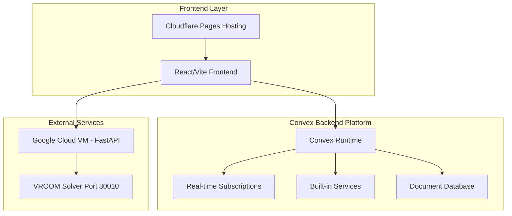
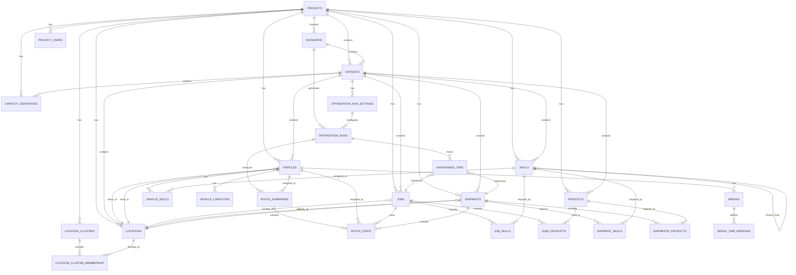

# VRP System - Convex Database Schema

## Architecture Overview



## Convex Function Types & Patterns

### Core Function Types in VRP System

#### 📖 Queries (Read Operations)
- **Projects.list()** - Get user's projects with real-time updates
- **Vehicles.getByDataset()** - Live vehicle data for optimization
- **Jobs.getOptimizable()** - Real-time job status for routing
- **Routes.getLive()** - Live route visualization updates
- **Frontend Hook:** `useQuery(api.projects.list)`
- **Auto-reactive:** UI updates when data changes

#### ✏️ Mutations (Write Operations)
- **Projects.create()** - ACID project creation with validation
- **Vehicles.bulkImport()** - Transactional CSV imports
- **Routes.updateOptimization()** - Store VROOM results
- **Jobs.assignToVehicle()** - Manual route adjustments
- **Frontend Hook:** `useMutation(api.projects.create)`
- **Auto-optimistic:** UI updates before server confirmation

#### 🚀 Actions (External Calls)
- **Optimization.runVROOM()** - Call FastAPI + VROOM solver
- **Import.processCSV()** - Handle file uploads & parsing
- **Export.generateReport()** - Create PDF/Excel exports
- **Geocoding.batchLocations()** - External geocoding APIs
- **Frontend Hook:** `useAction(api.optimization.runVROOM)`
- **Long-running:** Perfect for optimization workflows

#### 🌐 HTTP Actions (REST APIs)
- **webhooks/vroom-complete** - VROOM solver callbacks
- **api/import/csv** - File upload endpoints
- **api/export/routes** - Data export endpoints
- **api/health/check** - System health monitoring
- **Usage:** Standard REST API endpoints
- **Integration:** External systems and webhooks

### VRP-Specific Convex Patterns

#### 🛣️ Real-time Route Optimization Flow

```typescript
// 1. Frontend triggers optimization
const runOptimization = useAction(api.optimization.runVROOM);
await runOptimization({ datasetId, optimizationSettings });

// 2. Action calls external FastAPI
export const runVROOM = action({
  handler: async (ctx, { datasetId, settings }) => {
    // Get data from Convex
    const vehicles = await ctx.runQuery(api.vehicles.getByDataset, { datasetId });
    const jobs = await ctx.runQuery(api.jobs.getByDataset, { datasetId });
    
    // Call external FastAPI + VROOM
    const response = await fetch('http://fastapi:8000/optimize', {
      method: 'POST',
      body: JSON.stringify({ vehicles, jobs, settings })
    });
    
    // Store results back in Convex
    await ctx.runMutation(api.routes.storeOptimizationResults, {
      datasetId,
      results: await response.json()
    });
  }
});

// 3. Frontend automatically updates with new routes
const routes = useQuery(api.routes.getByOptimization, { optimizationId });
```

### Convex Hooks & Real-time Integration

| Hook Type | Usage Pattern | VRP Example | Benefits |
|-----------|---------------|-------------|----------|
| **useQuery** | Reactive data fetching | `useQuery(api.vehicles.list, { datasetId })` | Auto-updates when vehicles change |
| **useMutation** | Optimistic UI updates | `useMutation(api.jobs.create)` | Instant UI feedback + rollback on error |
| **useAction** | Long-running operations | `useAction(api.optimization.run)` | Perfect for VROOM optimization calls |
| **usePaginatedQuery** | Large dataset handling | `usePaginatedQuery(api.routes.listPaginated)` | Efficient loading of route history |
| **useConvex** | Direct client access | `convex.query(api.status.health)` | Non-reactive one-time queries |

## Complete Tech Stack Analysis

### Current Production Stack

#### 🎨 Frontend Layer
- **Framework:** React 18.3+ with TypeScript
- **Build Tool:** Vite 5.4+ (Fast HMR, ES modules)
- **UI Library:** ~~Material-UI (MUI) v6+ with Joy UI~~ → shadcn/ui + Tailwind CSS
- **Styling:** ~~Emotion CSS-in-JS + MUI System~~ → Tailwind CSS + CSS Modules
- **State Management:** React Context + useReducer
- **Routing:** React Router v6
- **Forms:** React Hook Form + Zod validation
- **Testing:** Vitest + React Testing Library
- **Hosting:** Cloudflare Pages (GitHub integration)

#### ⚡ Backend Layer
- **Database:** PostgreSQL 15+ with RLS
- **API:** Supabase Edge Functions (TypeScript/Deno)
- **Authentication:** Supabase Auth with JWT
- **Real-time:** Supabase Realtime subscriptions
- **Storage:** Supabase Storage for file uploads
- **Optimization:** FastAPI (Python 3.13+) + VROOM
- **ORM:** asyncpg for database connections
- **Deployment:** Google Cloud VM (optimization only)

### Convex Full-Stack Platform (Clean Slate Approach)

#### 🚀 Complete Convex Built-in Capabilities

##### 🎯 Core Platform Features
- **Database:** Convex Document Database (NoSQL with relations)
- **Authentication:** Convex Auth (built-in) - Selected authentication system
- **API:** Convex Functions (TypeScript)
- **Real-time:** Convex Live Queries (reactive subscriptions)
- **File Storage:** Convex File Storage (integrated)
- **Vector Search:** Built-in vector database for AI
- **Scheduling:** Convex Cron Jobs + Workflows
- **Hosting:** Convex Cloud (auto-scaling edge deployment)

##### 🔧 Advanced Built-in Tools
- **Rate Limiting:** Application-layer rate limits (built-in)
- **Aggregations:** Real-time counts and sums
- **Workflows:** Durable execution patterns
- **Workpools:** Managed parallelism and queuing
- **Components:** Reusable backend modules
- **Testing:** Convex Test Harness (pure-JS testing)
- **Validation:** Runtime type validation (built-in)
- **Deployment:** Zero-downtime deploys + rollbacks

### Recommended Frontend Stack for Convex

#### ⚡ Optimal Choice: Modern React Stack
- **Framework:** React 18.3+ with TypeScript (Keep)
- **Build Tool:** Vite 5.4+ (Perfect Convex integration)
- **UI Library:** shadcn/ui + Tailwind CSS 🎯
- **State Management:** Convex + Zustand 🎯
- **Forms:** React Hook Form + Zod (Keep)
- **Animations:** Framer Motion (Convex compatible)
- **Charts:** Recharts or D3.js for VRP visualizations
- **Maps:** Leaflet + React-Leaflet for route visualization
- **Testing:** Vitest + Convex Test Helpers
- **Hosting:** Cloudflare Pages (current, free tier)

#### 🔄 Alternative: Keep MUI (Lower Risk)
- **Framework:** React 18.3+ with TypeScript
- **Build Tool:** Vite 5.4+
- **UI Library:** Material-UI (MUI) v6+ (Not selected - Alternative option)
- **State Management:** Convex + MUI patterns (Alternative - not selected)
- **Styling:** Emotion CSS-in-JS + MUI System (Alternative - not selected)
- **Benefits:** Lower migration effort, existing team knowledge
- **Trade-offs:** Larger bundle size, less optimization

### VRP-Specific Technology Stack

#### 🚛 VRP System Optimizations
- **Optimization Engine:** Keep FastAPI (Python 3.13+) + VROOM
- **Geospatial:** Leaflet + React-Leaflet for route visualization
- **Charts:** Recharts for optimization metrics
- **Real-time Updates:** Convex Live Queries for route changes
- **File Imports:** Convex File Storage for CSV/Excel uploads
- **Background Jobs:** Convex Workflows for long optimizations
- **Rate Limiting:** Convex Rate Limiter for API protection
- **Data Export:** Convex Actions for report generation

### Complete Package.json Dependencies (Convex Optimized)

```json
{
  "dependencies": {
    // Core Framework (Keep)
    "react": "^18.3.1",
    "react-dom": "^18.3.1",
    "typescript": "^5.5.4",
    
    // Convex Full Stack Platform
    "convex": "^1.16.0",
    "@convex-dev/react-query": "^0.0.0-alpha.4",
    "convex-helpers": "^0.1.57",
    
    // Authentication - Selected: Convex Auth
    "convex-auth": "^0.0.65",              // Selected authentication option
    // "@clerk/clerk-react": "^5.7.0",     // Alternative: Clerk (not selected)
    
    // State Management
    "zustand": "^4.5.5",
    
    // UI Library - Selected: shadcn/ui
    "@radix-ui/react-*": "latest",
    "tailwindcss": "^3.4.0",
    "class-variance-authority": "^0.7.0",
    "clsx": "^2.1.1",
    "tailwind-merge": "^2.5.0",
    
    // UI Library Alternative: MUI (not selected)
    // "@mui/material": "^6.1.0",
    // "@mui/joy": "^5.0.0",
    // "@emotion/react": "^11.13.0",
    // "@emotion/styled": "^11.13.0",
    
    // Forms & Validation (Keep)
    "react-hook-form": "^7.53.0",
    "zod": "^3.23.8",
    "@hookform/resolvers": "^3.9.0",
    
    // Routing & Navigation (Keep)
    "react-router-dom": "^6.26.1",
    
    // VRP-Specific Visualization
    "recharts": "^2.12.7",
    "leaflet": "^1.9.4",
    "react-leaflet": "^4.2.1",
    "d3": "^7.9.0",
    
    // Animations & UI Enhancement
    "framer-motion": "^11.5.4",
    "lucide-react": "^0.441.0",
    
    // Utilities (Keep)
    "date-fns": "^3.6.0",
    "lodash-es": "^4.17.21",
    
    // External API Integration (Keep for FastAPI)
    "axios": "^1.7.4"
  },
  "devDependencies": {
    // Build Tools (Keep)
    "@vitejs/plugin-react": "^4.3.1",
    "vite": "^5.4.0",
    
    // Testing (Enhanced with Convex)
    "vitest": "^2.0.5",
    "@testing-library/react": "^16.0.0",
    "convex-test": "^0.0.25",
    
    // Code Quality (Keep)
    "eslint": "^9.9.0",
    "@typescript-eslint/eslint-plugin": "^8.1.0",
    "prettier": "^3.3.3"
  }
}
```

### Technology Decision Matrix

| Component | Current | Convex Optimized | Migration Effort | Benefits |
|-----------|---------|------------------|------------------|----------|
| **Database** | PostgreSQL + Supabase | Convex Document DB | High (4-5 weeks) | No SQL, auto-scaling, real-time, type-safe |
| **API Layer** | Supabase Edge Functions | Convex Functions | Medium (3-4 weeks) | Better TypeScript, faster cold starts, auto-optimization |
| **Authentication** | Supabase Auth | **Convex Auth** (Selected) | Medium (2-3 weeks) | Better integration, more providers, type-safe |
| **Real-time** | Supabase Realtime | Convex Live Queries | Low (1-2 weeks) | Automatic reactivity, optimistic updates, no setup |
| **File Storage** | Supabase Storage | Convex File Storage | Low (1 week) | Integrated with database, automatic URLs |
| **UI Library** | MUI v6 + Joy UI | **shadcn/ui + Tailwind** (Selected) | High (4-6 weeks) | 60% smaller bundle, better performance, modern design |
| **State Management** | React Context | Convex + Zustand | Medium (2-3 weeks) | Type-safe, reactive, automatic sync |
| **Build System** | Vite | Vite (Keep) | None | Perfect compatibility with Convex |
| **Optimization** | FastAPI + VROOM | FastAPI + VROOM (Keep) | None | Specialized optimization remains external |

## Entity Relationship Diagram



## Data Flow Architecture

```mermaid
graph TD
    subgraph "User Interface Layer"
        A[Projects Dashboard]
        B[Scenarios Management]
        C[Datasets Editor]
        D[Vehicle Management]
        E[Job Management]
        F[Location Management]
        G[Optimization Console]
        H[Results Viewer]
    end
    
    subgraph "Convex Functions Layer"
        I[Project CRUD]
        J[Scenario CRUD]
        K[Dataset CRUD]
        L[Vehicle CRUD]
        M[Job CRUD]
        N[Location CRUD]
        O[Optimization Trigger]
        P[Results Processing]
        Q[Skills Management]
        R[Products Management]
    end
    
    subgraph "External Optimization"
        S[FastAPI Backend]
        T[VROOM Solver]
    end
    
    subgraph "Convex Database - Core Collections"
        U[Projects]
        V[Scenarios]
        W[Datasets]
        X[Project_Users]
    end
    
    subgraph "Convex Database - VRP Entities"
        Y[Vehicles]
        Z[Jobs]
        AA[Locations]
        AB[Shipments]
        AC[Products]
        AD[Skills]
        AE[Capacity_Definitions]
    end
    
    subgraph "Convex Database - Optimization"
        AF[Optimization_Run_Settings]
        AG[Optimization_Runs]
        AH[Route_Summaries]
        AI[Route_Steps]
        AJ[Unassigned_Jobs]
    end
    
    subgraph "Convex Database - Supporting Tables"
        AK[Breaks]
        AL[Break_Time_Windows]
        AM[Location_Clusters]
        AN[Location_Cluster_Membership]
        AO[Vehicle_Skills]
        AP[Job_Skills]
        AQ[Shipment_Skills]
        AR[Vehicle_Capacities]
        AS[Jobs_Products]
        AT[Shipments_Products]
    end
    
    %% UI to Functions
    A --> I
    B --> J
    C --> K
    D --> L
    E --> M
    F --> N
    G --> O
    H --> P
    
    %% Functions to Core DB
    I --> U
    I --> X
    J --> V
    K --> W
    
    %% Functions to VRP Entities
    L --> Y
    M --> Z
    N --> AA
    Q --> AD
    R --> AC
    
    %% Dataset relationships
    W --> Y
    W --> Z
    W --> AA
    W --> AB
    W --> AE
    W --> AF
    
    %% Optimization flow
    O --> S
    S --> T
    T --> P
    P --> AG
    P --> AH
    P --> AI
    P --> AJ
    
    %% Supporting relationships
    Y --> AK
    AK --> AL
    AA --> AM
    AA --> AN
    AM --> AN
    
    %% Skill relationships
    Y --> AO
    Z --> AP
    AB --> AQ
    AD --> AO
    AD --> AP
    AD --> AQ
    
    %% Product relationships
    Z --> AS
    AB --> AT
    AC --> AS
    AC --> AT
    
    %% Capacity relationships
    Y --> AR
    AE --> AR
```



## Convex Schema Definitions

### Nullable Status Legend

**Understanding Field Requirements:**
- **Required Fields (Not Nullable)**: Fields without `v.optional()` wrapper are mandatory
- **Optional Fields (Nullable)**: Fields wrapped with `v.optional()` are nullable/optional
- **Convex IDs**: All `v.id("tableName")` references are required unless wrapped in `v.optional()`
- **Timestamps**: `createdAt` and `updatedAt` are typically required for audit trails

**Key Patterns:**
```typescript
name: v.string(),                    // ✅ REQUIRED - Cannot be null
description: v.optional(v.string()), // ❓ OPTIONAL - Can be null
projectId: v.id("projects"),         // ✅ REQUIRED - Foreign key relationship
scenarioId: v.optional(v.id("scenarios")), // ❓ OPTIONAL - Nullable relationship
```

### Core Collections

```typescript
// schema.ts
import { defineSchema, defineTable } from "convex/server";
import { v } from "convex/values";

export default defineSchema({
  // Projects - Core project entity
  projects: defineTable({
    // REQUIRED FIELDS (Not Nullable)
    name: v.string(),                    // ✅ Project name - always required
    ownerId: v.string(),                 // ✅ User ID from Convex Auth - required for ownership
    createdAt: v.number(),               // ✅ Creation timestamp - required for audit
    updatedAt: v.number(),               // ✅ Last update timestamp - required for audit
    
    // OPTIONAL FIELDS (Nullable)
    description: v.optional(v.string()),           // ❓ Project description
    currency: v.optional(v.string()),              // ❓ Currency code (USD, EUR, etc.)
    projectType: v.optional(v.string()),           // ❓ Project classification
    industry: v.optional(v.string()),              // ❓ Industry sector
    geographicRegion: v.optional(v.string()),      // ❓ Operating region
    priority: v.optional(v.string()),              // ❓ Project priority level
    estimatedVehicles: v.optional(v.number()),     // ❓ Expected vehicle count
    estimatedJobs: v.optional(v.number()),         // ❓ Expected job count
    planningHorizonDays: v.optional(v.number()),   // ❓ Planning period length
    contactPerson: v.optional(v.string()),         // ❓ Primary contact name
    contactEmail: v.optional(v.string()),          // ❓ Contact email
    contactPhone: v.optional(v.string()),          // ❓ Contact phone
    tags: v.optional(v.array(v.string())),         // ❓ Project tags for filtering
    notes: v.optional(v.string()),                 // ❓ Additional notes
  })
    .index("by_owner", ["ownerId"])
    .index("by_created_at", ["createdAt"])
    .index("by_updated_at", ["updatedAt"]),

  // Scenarios - Project optimization scenarios
  scenarios: defineTable({
    // REQUIRED FIELDS (Not Nullable)
    projectId: v.id("projects"),         // ✅ Parent project reference - required relationship
    name: v.string(),                    // ✅ Scenario name - always required
    createdAt: v.number(),               // ✅ Creation timestamp - required for audit
    updatedAt: v.number(),               // ✅ Last update timestamp - required for audit
    
    // OPTIONAL FIELDS (Nullable)
    description: v.optional(v.string()),              // ❓ Scenario description
    startDate: v.optional(v.number()),                // ❓ Scenario start date
    endDate: v.optional(v.number()),                  // ❓ Scenario end date
    planningHorizonDays: v.optional(v.number()),      // ❓ Planning period override
    optimizationObjective: v.optional(v.string()),    // ❓ Primary optimization goal
    optimizationParameters: v.optional(v.object({})), // ❓ Custom optimization settings
    status: v.optional(v.string()),                   // ❓ Current scenario status
    tags: v.optional(v.array(v.string())),            // ❓ Scenario tags
    isActive: v.optional(v.boolean()),                // ❓ Active scenario flag
    lastOptimizedAt: v.optional(v.number()),          // ❓ Last optimization timestamp
    optimizationCount: v.optional(v.number()),        // ❓ Number of optimizations run
  })
    .index("by_project", ["projectId"])
    .index("by_status", ["status"])
    .index("by_created_at", ["createdAt"]),

  // Datasets - Data collections for optimization
  datasets: defineTable({
    // REQUIRED FIELDS (Not Nullable)
    projectId: v.id("projects"),         // ✅ Parent project reference - required relationship
    name: v.string(),                    // ✅ Dataset name - always required
    version: v.number(),                 // ✅ Dataset version number - required for versioning
    createdAt: v.number(),               // ✅ Creation timestamp - required for audit
    updatedAt: v.number(),               // ✅ Last update timestamp - required for audit
    
    // OPTIONAL FIELDS (Nullable)
    scenarioId: v.optional(v.id("scenarios")),        // ❓ Optional scenario assignment
    description: v.optional(v.string()),              // ❓ Dataset description
    status: v.optional(v.string()),                   // ❓ Dataset status (active, archived, etc.)
    createdFromDatasetId: v.optional(v.id("datasets")), // ❓ Source dataset for cloning
    isBaseline: v.optional(v.boolean()),              // ❓ Baseline dataset flag
    tags: v.optional(v.array(v.string())),            // ❓ Dataset tags
    vehicleCount: v.optional(v.number()),             // ❓ Cached vehicle count
    jobCount: v.optional(v.number()),                 // ❓ Cached job count
    locationCount: v.optional(v.number()),            // ❓ Cached location count
    optimizationRunCount: v.optional(v.number()),     // ❓ Number of optimization runs
    optimizationCount: v.optional(v.number()),        // ❓ Total optimization count
    lastOptimizationAt: v.optional(v.number()),       // ❓ Last optimization timestamp
    datasetType: v.optional(v.string()),              // ❓ Dataset type classification
    versionNote: v.optional(v.string()),              // ❓ Version change notes
    entityCounts: v.optional(v.object({               // ❓ Detailed entity counts
      jobs: v.number(),                               // Required if entityCounts exists
      vehicles: v.number(),                           // Required if entityCounts exists
      locations: v.number(),                          // Required if entityCounts exists
    })),
    createdBy: v.optional(v.string()),                // ❓ User who created the dataset
    archivedAt: v.optional(v.number()),               // ❓ Archive timestamp
  })
    .index("by_project", ["projectId"])
    .index("by_scenario", ["scenarioId"])
    .index("by_status", ["status"])
    .index("by_version", ["projectId", "version"]),

  // Vehicles - Fleet vehicle definitions
  vehicles: defineTable({
    // REQUIRED FIELDS (Not Nullable)
    projectId: v.id("projects"),         // ✅ Parent project reference - required relationship
    createdAt: v.number(),               // ✅ Creation timestamp - required for audit
    updatedAt: v.number(),               // ✅ Last update timestamp - required for audit
    
    // OPTIONAL FIELDS (Nullable)
    scenarioId: v.optional(v.id("scenarios")),        // ❓ Optional scenario assignment
    datasetId: v.optional(v.id("datasets")),          // ❓ Optional dataset assignment
    description: v.optional(v.string()),              // ❓ Vehicle description/name
    profile: v.optional(v.string()),                  // ❓ Vehicle profile (car, truck, bike)
    
    // Location coordinates (either coordinates or location references)
    startLon: v.optional(v.number()),                 // ❓ Starting longitude
    startLat: v.optional(v.number()),                 // ❓ Starting latitude
    endLon: v.optional(v.number()),                   // ❓ Ending longitude
    endLat: v.optional(v.number()),                   // ❓ Ending latitude
    startLocationId: v.optional(v.id("locations")),   // ❓ Starting location reference
    endLocationId: v.optional(v.id("locations")),     // ❓ Ending location reference
    
    // Vehicle capabilities
    capacity: v.optional(v.array(v.number())),        // ❓ Multi-dimensional capacity array
    skills: v.optional(v.array(v.number())),          // ❓ Vehicle skill IDs
    
    // Time windows and constraints
    twStart: v.optional(v.number()),                  // ❓ Time window start
    twEnd: v.optional(v.number()),                    // ❓ Time window end
    speedFactor: v.optional(v.number()),              // ❓ Speed modification factor
    maxTasks: v.optional(v.number()),                 // ❓ Maximum tasks per route
    maxTravelTime: v.optional(v.number()),            // ❓ Maximum travel time
    maxDistance: v.optional(v.number()),              // ❓ Maximum distance
    
    // Cost structure
    costFixed: v.optional(v.number()),                // ❓ Fixed cost per vehicle
    costPerHour: v.optional(v.number()),              // ❓ Hourly operating cost
    costPerKm: v.optional(v.number()),                // ❓ Distance-based cost
    
    // Dataset metadata
    datasetName: v.optional(v.string()),              // ❓ Source dataset name
    datasetVersion: v.optional(v.number()),           // ❓ Source dataset version
  })
    .index("by_project", ["projectId"])
    .index("by_scenario", ["scenarioId"])
    .index("by_dataset", ["datasetId"])
    .index("by_location", ["startLocationId"])
    .index("by_created_at", ["createdAt"]),

  // Jobs - Individual tasks/stops for vehicles
  jobs: defineTable({
    // REQUIRED FIELDS (Not Nullable)
    projectId: v.id("projects"),         // ✅ Parent project reference - required relationship
    createdAt: v.number(),               // ✅ Creation timestamp - required for audit
    updatedAt: v.number(),               // ✅ Last update timestamp - required for audit
    
    // OPTIONAL FIELDS (Nullable)
    scenarioId: v.optional(v.id("scenarios")),        // ❓ Optional scenario assignment
    datasetId: v.optional(v.id("datasets")),          // ❓ Optional dataset assignment
    locationId: v.optional(v.id("locations")),        // ❓ Location reference
    description: v.optional(v.string()),              // ❓ Job description
    
    // Location coordinates (alternative to locationId)
    locationLon: v.optional(v.number()),              // ❓ Job longitude
    locationLat: v.optional(v.number()),              // ❓ Job latitude
    
    // Time requirements
    setup: v.optional(v.number()),                    // ❓ Setup time (seconds)
    service: v.optional(v.number()),                  // ❓ Service time (seconds)
    
    // Capacity requirements
    delivery: v.optional(v.array(v.number())),        // ❓ Delivery quantities
    pickup: v.optional(v.array(v.number())),          // ❓ Pickup quantities
    
    // Job constraints
    skills: v.optional(v.array(v.number())),          // ❓ Required skill IDs
    priority: v.optional(v.number()),                 // ❓ Job priority level
    timeWindows: v.optional(v.array(v.object({        // ❓ Valid service time windows
      start: v.number(),                              // Required if timeWindows exists
      end: v.number(),                                // Required if timeWindows exists
    }))),
    
    // Dataset metadata
    datasetName: v.optional(v.string()),              // ❓ Source dataset name
    datasetVersion: v.optional(v.number()),           // ❓ Source dataset version
  })
    .index("by_project", ["projectId"])
    .index("by_scenario", ["scenarioId"])
    .index("by_dataset", ["datasetId"])
    .index("by_location", ["locationId"])
    .index("by_priority", ["priority"])
    .index("by_created_at", ["createdAt"]),

  // Locations - Geographic points of interest
  locations: defineTable({
    // REQUIRED FIELDS (Not Nullable)
    projectId: v.id("projects"),         // ✅ Parent project reference - required relationship
    name: v.string(),                    // ✅ Location name - always required
    createdAt: v.number(),               // ✅ Creation timestamp - required for audit
    updatedAt: v.number(),               // ✅ Last update timestamp - required for audit
    
    // OPTIONAL FIELDS (Nullable)
    scenarioId: v.optional(v.id("scenarios")),        // ❓ Optional scenario assignment
    datasetId: v.optional(v.id("datasets")),          // ❓ Optional dataset assignment
    clusterId: v.optional(v.id("locationClusters")),  // ❓ Location cluster assignment
    address: v.optional(v.string()),                  // ❓ Physical address
    description: v.optional(v.string()),              // ❓ Location description
    locationLon: v.optional(v.number()),              // ❓ Longitude coordinate
    locationLat: v.optional(v.number()),              // ❓ Latitude coordinate
    locationType: v.optional(v.string()),             // ❓ Type (depot, customer, warehouse)
    operatingHours: v.optional(v.string()),           // ❓ Operating hours string
    contactInfo: v.optional(v.string()),              // ❓ Contact information
    timezone: v.optional(v.string()),                 // ❓ Location timezone
    datasetName: v.optional(v.string()),              // ❓ Source dataset name
    datasetVersion: v.optional(v.number()),           // ❓ Source dataset version
  })
    .index("by_project", ["projectId"])
    .index("by_scenario", ["scenarioId"])
    .index("by_dataset", ["datasetId"])
    .index("by_cluster", ["clusterId"])
    .index("by_type", ["locationType"])
    .index("by_name", ["name"]),

  // Products - Items being transported
  products: defineTable({
    // REQUIRED FIELDS (Not Nullable)
    projectId: v.id("projects"),         // ✅ Parent project reference - required relationship
    name: v.string(),                    // ✅ Product name - always required
    unitType: v.string(),                // ✅ Unit of measurement - required for calculations
    createdAt: v.number(),               // ✅ Creation timestamp - required for audit
    updatedAt: v.number(),               // ✅ Last update timestamp - required for audit
    
    // OPTIONAL FIELDS (Nullable)
    category: v.optional(v.string()),                 // ❓ Product category
    weightPerUnitKg: v.optional(v.number()),          // ❓ Weight per unit in kilograms
    volumePerUnitM3: v.optional(v.number()),          // ❓ Volume per unit in cubic meters
    lengthCm: v.optional(v.number()),                 // ❓ Length in centimeters
    widthCm: v.optional(v.number()),                  // ❓ Width in centimeters
    heightCm: v.optional(v.number()),                 // ❓ Height in centimeters
    stackable: v.optional(v.boolean()),               // ❓ Can be stacked flag
    requiresRefrigeration: v.optional(v.boolean()),   // ❓ Refrigeration required flag
    hazmatClass: v.optional(v.string()),              // ❓ Hazardous material classification
    handlingInstructions: v.optional(v.string()),     // ❓ Special handling instructions
  })
    .index("by_project", ["projectId"])
    .index("by_category", ["category"])
    .index("by_name", ["name"]),

  // Skills - Capabilities required for jobs or possessed by vehicles
  skills: defineTable({
    // REQUIRED FIELDS (Not Nullable)
    createdAt: v.number(),               // ✅ Creation timestamp - required for audit
    updatedAt: v.number(),               // ✅ Last update timestamp - required for audit
    
    // OPTIONAL FIELDS (Nullable) - Note: Skills can be global or project-specific
    projectId: v.optional(v.id("projects")),          // ❓ Optional project scope (null = global skill)
    name: v.optional(v.string()),                     // ❓ Skill name
    description: v.optional(v.string()),              // ❓ Skill description
    skillCode: v.optional(v.string()),                // ❓ Unique skill code
    category: v.optional(v.string()),                 // ❓ Skill category
    subcategory: v.optional(v.string()),              // ❓ Skill subcategory
    parentSkillId: v.optional(v.id("skills")),        // ❓ Parent skill for hierarchy
    skillType: v.optional(v.string()),                // ❓ Type of skill
    requiresCertification: v.optional(v.boolean()),   // ❓ Certification required flag
    certificationAuthority: v.optional(v.string()),   // ❓ Certifying authority
    certificationExpiryRequired: v.optional(v.boolean()), // ❓ Expiry tracking required
    vroomSkillId: v.optional(v.number()),             // ❓ VROOM solver skill ID
    isActive: v.optional(v.boolean()),                // ❓ Active skill flag
  })
    .index("by_project", ["projectId"])
    .index("by_category", ["category"])
    .index("by_skill_code", ["skillCode"])
    .index("by_parent", ["parentSkillId"]),

  // Optimization Run Settings - Configuration for optimization algorithms
  optimizationRunSettings: defineTable({
    // REQUIRED FIELDS (Not Nullable)
    datasetId: v.id("datasets"),         // ✅ Target dataset - required relationship
    name: v.string(),                    // ✅ Settings name - always required
    algorithm: v.string(),               // ✅ Algorithm type - required for execution
    optimizationEngine: v.string(),      // ✅ Engine type (VROOM, OR-Tools) - required
    parameters: v.object({               // ✅ Algorithm parameters - required object
      maxIterations: v.optional(v.number()),         // ❓ Maximum iterations
      timeLimit: v.optional(v.number()),             // ❓ Time limit in seconds
      vehicleBreaks: v.optional(v.boolean()),        // ❓ Enable vehicle breaks
      trafficMatrix: v.optional(v.boolean()),        // ❓ Use traffic matrix
      balanceRoutes: v.optional(v.boolean()),        // ❓ Balance route loads
      minimizeVehicles: v.optional(v.boolean()),     // ❓ Minimize vehicle count
      allowSplitDeliveries: v.optional(v.boolean()), // ❓ Allow split deliveries
    }),
    createdAt: v.number(),               // ✅ Creation timestamp - required for audit
    updatedAt: v.number(),               // ✅ Last update timestamp - required for audit
    
    // OPTIONAL FIELDS (Nullable)
    description: v.optional(v.string()),              // ❓ Settings description
    constraints: v.optional(v.object({                // ❓ Optimization constraints
      maxVehicleCapacity: v.optional(v.number()),     // ❓ Maximum vehicle capacity
      maxRouteDistance: v.optional(v.number()),       // ❓ Maximum route distance
      maxRouteDuration: v.optional(v.number()),       // ❓ Maximum route duration
      enforceTimeWindows: v.optional(v.boolean()),    // ❓ Enforce time windows
      enforceSkillMatching: v.optional(v.boolean()),  // ❓ Enforce skill matching
    })),
    objectives: v.optional(v.object({                 // ❓ Optimization objectives
      minimizeCost: v.optional(v.number()),           // ❓ Cost minimization weight
      minimizeDistance: v.optional(v.number()),       // ❓ Distance minimization weight
      minimizeDuration: v.optional(v.number()),       // ❓ Duration minimization weight
      maximizeServiceLevel: v.optional(v.number()),   // ❓ Service level weight
    })),
    isDefault: v.optional(v.boolean()),               // ❓ Default settings flag
    isActive: v.optional(v.boolean()),                // ❓ Active settings flag
    createdBy: v.optional(v.string()),                // ❓ User who created settings
  })
    .index("by_dataset", ["datasetId"])
    .index("by_algorithm", ["algorithm"])
    .index("by_default", ["isDefault"])
    .index("by_active", ["isActive"]),

  // Optimization Runs - Results of optimization executions
  optimizationRuns: defineTable({
    // REQUIRED FIELDS (Not Nullable)
    scenarioId: v.id("scenarios"),       // ✅ Parent scenario - required relationship
    timestamp: v.number(),               // ✅ Run timestamp - required for tracking
    currencyCode: v.string(),            // ✅ Currency for cost calculations - required
    algorithm: v.string(),               // ✅ Algorithm used - required for reference
    durationMs: v.number(),              // ✅ Execution duration - required for performance tracking
    settings: v.object({}),              // ✅ Settings used - required for reproducibility
    optimizationEngine: v.string(),      // ✅ Engine used - required for tracking
    optimizationParameters: v.object({}), // ✅ Parameters used - required for reproducibility
    
    // OPTIONAL FIELDS (Nullable)
    projectId: v.optional(v.id("projects")),          // ❓ Optional project reference (derived from scenario)
    datasetId: v.optional(v.id("datasets")),          // ❓ Optional dataset reference
    optimizationRunSettingsId: v.optional(v.id("optimizationRunSettings")), // ❓ Settings template used
    
    // Execution metadata
    computingTime: v.optional(v.number()),            // ❓ Server computing time
    status: v.optional(v.string()),                   // ❓ Run status (success, failed, running)
    errorMessage: v.optional(v.string()),             // ❓ Error details if failed
    
    // Result summary statistics
    totalCost: v.optional(v.number()),                // ❓ Total optimization cost
    totalRoutes: v.optional(v.number()),              // ❓ Number of routes generated
    totalUnassigned: v.optional(v.number()),          // ❓ Number of unassigned tasks
    totalDistance: v.optional(v.number()),            // ❓ Total distance traveled
    totalDuration: v.optional(v.number()),            // ❓ Total route duration
    totalWaitingTime: v.optional(v.number()),         // ❓ Total waiting time
    totalServiceTime: v.optional(v.number()),         // ❓ Total service time
    totalSetupTime: v.optional(v.number()),           // ❓ Total setup time
    totalVehicles: v.optional(v.number()),            // ❓ Number of vehicles used
    totalJobs: v.optional(v.number()),                // ❓ Number of jobs processed
    totalShipments: v.optional(v.number()),           // ❓ Number of shipments processed
    
    // Raw data for debugging
    rawRequest: v.optional(v.object({})),             // ❓ Original solver request
    rawResponse: v.optional(v.object({})),            // ❓ Raw solver response
    
    // Dataset metadata
    datasetName: v.optional(v.string()),              // ❓ Source dataset name
    datasetVersion: v.optional(v.number()),           // ❓ Source dataset version
    createdBy: v.optional(v.string()),                // ❓ User who initiated the run
  })
    .index("by_scenario", ["scenarioId"])
    .index("by_project", ["projectId"])
    .index("by_dataset", ["datasetId"])
    .index("by_settings", ["optimizationRunSettingsId"])
    .index("by_status", ["status"])
    .index("by_timestamp", ["timestamp"]),

  // Route Summaries - High-level route information per vehicle
  routeSummaries: defineTable({
    // REQUIRED FIELDS (Not Nullable)
    createdAt: v.number(),               // ✅ Creation timestamp - required for audit
    updatedAt: v.number(),               // ✅ Last update timestamp - required for audit
    
    // OPTIONAL FIELDS (Nullable) - Routes may be partial or in draft state
    optimizationRunId: v.optional(v.id("optimizationRuns")), // ❓ Parent optimization run
    vehicleId: v.optional(v.id("vehicles")),        // ❓ Assigned vehicle
    projectId: v.optional(v.id("projects")),        // ❓ Project reference
    
    // Route metrics
    cost: v.optional(v.number()),                   // ❓ Total route cost
    distance: v.optional(v.number()),               // ❓ Total distance traveled
    duration: v.optional(v.number()),               // ❓ Total route duration
    waitingTime: v.optional(v.number()),            // ❓ Total waiting time
    serviceTime: v.optional(v.number()),            // ❓ Total service time
    setupTime: v.optional(v.number()),              // ❓ Total setup time
    
    // Route content summary
    deliveries: v.optional(v.array(v.number())),    // ❓ Delivery quantities
    pickups: v.optional(v.array(v.number())),       // ❓ Pickup quantities
    priority: v.optional(v.number()),               // ❓ Route priority
    deliveryCount: v.optional(v.number()),          // ❓ Number of deliveries
    
    // Route violations and geometry
    violations: v.optional(v.array(v.object({}))),  // ❓ Constraint violations
    geometry: v.optional(v.string()),               // ❓ Route geometry (WKT/GeoJSON)
    geojson: v.optional(v.object({})),              // ❓ GeoJSON representation
    
    // Metadata
    currencyCode: v.optional(v.string()),           // ❓ Currency for cost values
    datasetName: v.optional(v.string()),            // ❓ Source dataset name
    datasetVersion: v.optional(v.number()),         // ❓ Source dataset version
  })
    .index("by_optimization_run", ["optimizationRunId"])
    .index("by_vehicle", ["vehicleId"])
    .index("by_project", ["projectId"])
    .index("by_created_at", ["createdAt"]),

  // Route Steps - Individual stops/actions within a route
  routeSteps: defineTable({
    // REQUIRED FIELDS (Not Nullable)
    stepType: v.string(),                // ✅ Step type (start, job, break, end) - required for sequence
    stepOrder: v.number(),               // ✅ Order within route - required for sequencing
    createdAt: v.number(),               // ✅ Creation timestamp - required for audit
    updatedAt: v.number(),               // ✅ Last update timestamp - required for audit
    
    // OPTIONAL FIELDS (Nullable)
    routeSummaryId: v.optional(v.id("routeSummaries")), // ❓ Parent route
    vehicleId: v.optional(v.id("vehicles")),       // ❓ Assigned vehicle
    optimizationRunId: v.optional(v.id("optimizationRuns")), // ❓ Parent optimization run
    projectId: v.optional(v.id("projects")),       // ❓ Project reference
    jobId: v.optional(v.id("jobs")),               // ❓ Associated job (if step is job visit)
    
    // Location information
    lon: v.optional(v.number()),                   // ❓ Longitude coordinate
    lat: v.optional(v.number()),                   // ❓ Latitude coordinate
    
    // Timing information
    arrivalTime: v.optional(v.number()),           // ❓ Arrival time at step
    setupTime: v.optional(v.number()),             // ❓ Setup time for this step
    serviceTime: v.optional(v.number()),           // ❓ Service time for this step
    waitingTime: v.optional(v.number()),           // ❓ Waiting time before service
    
    // Distance and duration to this step
    distance: v.optional(v.number()),              // ❓ Distance from previous step
    duration: v.optional(v.number()),              // ❓ Travel time from previous step
    
    // Load information
    load: v.optional(v.array(v.number())),         // ❓ Vehicle load after this step
    
    // Step metadata
    violations: v.optional(v.array(v.object({}))), // ❓ Constraint violations at this step
    description: v.optional(v.string()),           // ❓ Step description
    datasetName: v.optional(v.string()),           // ❓ Source dataset name
    datasetVersion: v.optional(v.number()),        // ❓ Source dataset version
  })
    .index("by_route_summary", ["routeSummaryId"])
    .index("by_vehicle", ["vehicleId"])
    .index("by_optimization_run", ["optimizationRunId"])
    .index("by_project", ["projectId"])
    .index("by_job", ["jobId"])
    .index("by_step_order", ["routeSummaryId", "stepOrder"]),

  // Supporting Tables
  locationClusterMembership: defineTable({
    locationId: v.id("locations"),
    clusterId: v.id("locationClusters"),
    createdAt: v.number(),
    updatedAt: v.number(),
  })
    .index("by_location", ["locationId"])
    .index("by_cluster", ["clusterId"]),

  locationClusters: defineTable({
    projectId: v.id("projects"),
    name: v.string(),
    description: v.optional(v.string()),
    centerLon: v.optional(v.number()),
    centerLat: v.optional(v.number()),
    radius: v.optional(v.number()),
    color: v.optional(v.string()),
    createdAt: v.number(),
    updatedAt: v.number(),
  })
    .index("by_project", ["projectId"]),

  projectUsers: defineTable({
    projectId: v.id("projects"),
    userId: v.string(),
    role: v.string(),
    permissions: v.optional(v.array(v.string())),
    invitedBy: v.optional(v.string()),
    invitedAt: v.optional(v.number()),
    joinedAt: v.optional(v.number()),
    status: v.optional(v.string()),
  })
    .index("by_project", ["projectId"])
    .index("by_user", ["userId"])
    .index("by_role", ["role"]),

  // Shipments
  shipments: defineTable({
    projectId: v.id("projects"),
    scenarioId: v.optional(v.id("scenarios")),
    datasetId: v.optional(v.id("datasets")),
    amount: v.optional(v.array(v.number())),
    skills: v.optional(v.array(v.number())),
    priority: v.optional(v.number()),
    pickupId: v.optional(v.number()),
    pickupDescription: v.optional(v.string()),
    pickupLon: v.number(),
    pickupLat: v.number(),
    pickupSetup: v.optional(v.number()),
    pickupService: v.optional(v.number()),
    pickupTimeWindows: v.optional(v.array(v.object({
      start: v.number(),
      end: v.number(),
    }))),
    pickupLocationId: v.optional(v.id("locations")),
    deliveryId: v.optional(v.number()),
    deliveryDescription: v.optional(v.string()),
    deliveryLon: v.number(),
    deliveryLat: v.number(),
    deliverySetup: v.optional(v.number()),
    deliveryService: v.optional(v.number()),
    deliveryTimeWindows: v.optional(v.array(v.object({
      start: v.number(),
      end: v.number(),
    }))),
    deliveryLocationId: v.optional(v.id("locations")),
    datasetName: v.optional(v.string()),
    datasetVersion: v.optional(v.number()),
    sourceShipmentId: v.optional(v.id("shipments")),
    isDerived: v.optional(v.boolean()),
    derivationMetadata: v.optional(v.object({})),
    pickupTimeWindowStartDt: v.optional(v.number()),
    pickupTimeWindowEndDt: v.optional(v.number()),
    deliveryTimeWindowStartDt: v.optional(v.number()),
    deliveryTimeWindowEndDt: v.optional(v.number()),
    pickupTimezone: v.optional(v.string()),
    deliveryTimezone: v.optional(v.string()),
    createdAt: v.number(),
    updatedAt: v.number(),
  })
    .index("by_project", ["projectId"])
    .index("by_scenario", ["scenarioId"])
    .index("by_dataset", ["datasetId"])
    .index("by_pickup_location", ["pickupLocationId"])
    .index("by_delivery_location", ["deliveryLocationId"])
    .index("by_priority", ["priority"]),

  // Breaks and Break Time Windows
  breaks: defineTable({
    vehicleId: v.optional(v.id("vehicles")),
    breakId: v.number(),
    service: v.optional(v.number()),
    description: v.optional(v.string()),
    maxLoad: v.optional(v.array(v.number())),
    breakType: v.optional(v.string()),
    regulationReference: v.optional(v.string()),
    isActive: v.optional(v.boolean()),
    createdAt: v.number(),
    updatedAt: v.number(),
  })
    .index("by_vehicle", ["vehicleId"])
    .index("by_break_id", ["breakId"])
    .index("by_type", ["breakType"]),

  breakTimeWindows: defineTable({
    breakId: v.optional(v.id("breaks")),
    startTime: v.number(),
    endTime: v.number(),
    createdAt: v.number(),
    updatedAt: v.number(),
  })
    .index("by_break", ["breakId"])
    .index("by_time_range", ["startTime", "endTime"]),

  // Capacity Definitions
  capacityDefinitions: defineTable({
    projectId: v.id("projects"),
    name: v.string(),
    unit: v.string(),
    dimensionIndex: v.number(),
    description: v.optional(v.string()),
    isActive: v.optional(v.boolean()),
    createdAt: v.number(),
  })
    .index("by_project", ["projectId"])
    .index("by_dimension", ["dimensionIndex"])
    .index("by_name", ["name"]),

  // Unassigned Jobs
  unassignedJobs: defineTable({
    optimizationRunId: v.optional(v.id("optimizationRuns")),
    originalId: v.optional(v.number()),
    taskType: v.optional(v.string()),
    jobId: v.optional(v.id("jobs")),
    shipmentId: v.optional(v.id("shipments")),
    lon: v.optional(v.number()),
    lat: v.optional(v.number()),
    description: v.optional(v.string()),
    datasetName: v.optional(v.string()),
    datasetVersion: v.optional(v.number()),
  })
    .index("by_optimization_run", ["optimizationRunId"])
    .index("by_job", ["jobId"])
    .index("by_shipment", ["shipmentId"])
    .index("by_task_type", ["taskType"]),

  // Junction Tables for Many-to-Many Relationships
  jobsProducts: defineTable({
    jobId: v.id("jobs"),
    productId: v.id("products"),
    quantity: v.number(),
    unitType: v.optional(v.string()),
    createdAt: v.number(),
  })
    .index("by_job", ["jobId"])
    .index("by_product", ["productId"]),

  shipmentsProducts: defineTable({
    shipmentId: v.id("shipments"),
    productId: v.id("products"),
    quantity: v.number(),
    calculatedWeight: v.optional(v.number()),
    calculatedVolume: v.optional(v.number()),
    capacityRequirements: v.optional(v.array(v.number())),
    createdAt: v.number(),
    updatedAt: v.number(),
  })
    .index("by_shipment", ["shipmentId"])
    .index("by_product", ["productId"]),

  vehicleCapacities: defineTable({
    vehicleId: v.id("vehicles"),
    capacityType: v.string(),
    capacity: v.number(),
    unit: v.optional(v.string()),
    createdAt: v.number(),
  })
    .index("by_vehicle", ["vehicleId"])
    .index("by_type", ["capacityType"]),

  vehicleSkills: defineTable({
    vehicleId: v.id("vehicles"),
    skillId: v.id("skills"),
    proficiencyLevel: v.optional(v.number()),
    certificationExpiry: v.optional(v.number()),
    createdAt: v.number(),
  })
    .index("by_vehicle", ["vehicleId"])
    .index("by_skill", ["skillId"]),

  jobSkills: defineTable({
    jobId: v.id("jobs"),
    skillId: v.id("skills"),
    requiredLevel: v.optional(v.number()),
    mandatory: v.optional(v.boolean()),
    createdAt: v.number(),
  })
    .index("by_job", ["jobId"])
    .index("by_skill", ["skillId"]),

  shipmentSkills: defineTable({
    shipmentId: v.id("shipments"),
    skillId: v.id("skills"),
    minimumProficiencyLevel: v.optional(v.number()),
    isMandatory: v.optional(v.boolean()),
    requirementSource: v.optional(v.string()),
    reasoning: v.optional(v.string()),
    createdAt: v.number(),
    updatedAt: v.number(),
  })
    .index("by_shipment", ["shipmentId"])
    .index("by_skill", ["skillId"]),
});
```

## Conversion Strategy from Supabase to Convex

### 1. Data Type Mapping

| Supabase Type | Convex Type | Notes |
|---------------|-------------|-------|
| `integer` | `v.number()` | Auto-increment becomes Convex ID |
| `varchar(n)` | `v.string()` | No length constraints in Convex |
| `text` | `v.string()` | No distinction in Convex |
| `boolean` | `v.boolean()` | Direct mapping |
| `jsonb` | `v.object({})` or `v.array()` | Typed objects preferred |
| `timestamp with time zone` | `v.number()` | Unix timestamp in milliseconds |
| `double precision` | `v.number()` | Direct mapping |
| `numeric(p,s)` | `v.number()` | Precision handled in application |
| `uuid` | `v.string()` | Use Convex Auth user IDs |
| `ARRAY` | `v.array()` | With typed elements |

### 2. Relationship Handling

- **Foreign Keys:** Use Convex IDs with type safety (`v.id("tableName")`)
- **Indexes:** Define indexes for common query patterns
- **RLS:** Replace with Convex Auth + function-level security

### 3. Migration Process

1. **Schema Definition:** Create Convex schema with proper types
2. **Data Export:** Export Supabase data to JSON
3. **Data Transform:** Convert data types and relationships
4. **Data Import:** Use Convex mutations to populate collections
5. **Function Migration:** Convert Edge Functions to Convex functions
6. **Auth Migration:** Migrate to Convex Auth
7. **Frontend Update:** Update API calls to use Convex

### 4. Key Benefits of Convex

- **Type Safety:** End-to-end TypeScript with runtime validation
- **Real-time:** Built-in reactive queries and subscriptions
- **Offline Support:** Automatic optimistic updates
- **No SQL:** Document-based queries with automatic indexes
- **Auth Integration:** Built-in authentication system
- **File Storage:** Integrated file upload and storage
- **Edge Functions:** Faster than Supabase Edge Functions

## Implementation Phases

### 📋 Phase 1: Core Schema (Week 1)
- Projects, Scenarios, Datasets
- Basic CRUD operations
- Authentication setup

### 🚛 Phase 2: VRP Entities (Week 2)
- Vehicles, Jobs, Locations
- Products, Skills
- Junction tables

### ⚡ Phase 3: Optimization (Week 3)
- Optimization runs
- Route summaries and steps
- FastAPI integration

### 🚀 Phase 4: Advanced Features (Week 4)
- Real-time subscriptions
- File uploads
- Advanced queries
- Performance optimization

### 🔄 Phase 5: Migration & Testing (Week 5)
- Data migration
- Comprehensive testing
- Production deployment
- Performance monitoring

## Nullable Status Summary

### Critical Required Fields (Never Nullable)

**Entity Identification:**
- `name` fields for all primary entities (projects, scenarios, datasets, locations, products)
- `projectId` relationships linking to parent projects
- `scenarioId` in optimization runs (required workflow relationship)
- `stepType` and `stepOrder` in route steps (required for sequencing)

**Audit & Tracking:**
- `createdAt` and `updatedAt` timestamps (required for all entities)
- `timestamp` in optimization runs (required for execution tracking)
- `currencyCode`, `algorithm`, `optimizationEngine` in optimization runs (required for reproducibility)

**Core Configuration:**
- `unitType` in products (required for capacity calculations)
- `version` in datasets (required for versioning)
- `ownerId` in projects (required for ownership/security)

### Common Optional Fields (Nullable)

**Flexible Relationships:**
- `scenarioId` and `datasetId` in most entities (optional assignment)
- `locationId` references (can use coordinates instead)
- Parent/child relationships (`parentSkillId`, `createdFromDatasetId`)

**Descriptive Information:**
- `description` fields across all entities
- Contact information (`contactEmail`, `contactPhone`, `contactInfo`)
- Classification fields (`category`, `locationType`, `projectType`)

**Operational Data:**
- Capacity arrays, time windows, geographic coordinates
- Cost information, optimization parameters
- Cache fields (`entityCounts`, `vehicleCount`, `jobCount`)
- Metadata fields (`tags`, `notes`, `datasetName`)

**Processing Results:**
- All optimization result statistics (`totalCost`, `totalDistance`, etc.)
- Route geometry and violations
- Error messages and status fields

### Developer Implementation Notes

1. **Form Validation:** Required fields should have client-side validation
2. **API Calls:** Always provide required fields in mutations
3. **Default Values:** Consider reasonable defaults for optional fields in UI
4. **Database Queries:** Filter by required fields for better performance
5. **Migration Safety:** Required fields need careful handling during data migration

## Key Highlights

✅ **Core VRP Tables:** Projects, Scenarios, Datasets, Vehicles, Jobs, Locations  
✅ **Optimization Data:** Route summaries, steps, optimization runs  
✅ **Supporting Data:** Products, Skills, Capacities, Time windows  
✅ **User Management:** Project users, authentication  
✅ **Real-time Ready:** Reactive queries and subscriptions  
✅ **Clear Nullable Status:** All fields clearly marked as required or optional  
✅ **Developer-Friendly:** Detailed comments explaining nullable status for each field  

The schema maintains **full compatibility** with your existing FastAPI backend while providing the benefits of Convex's type-safe, real-time architecture and **clear nullable status information** for all developers implementing the schema.